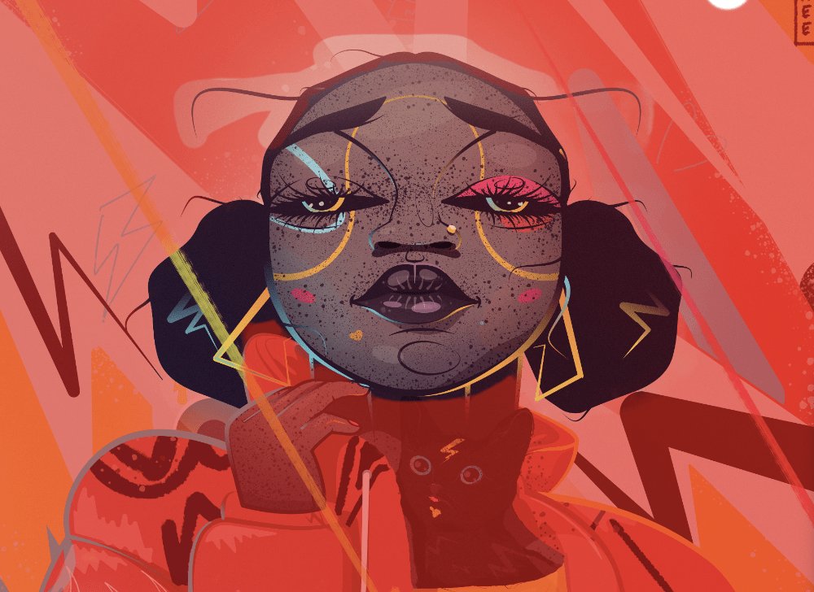

# 

 Refining pixel selection edges

Once a selection has been created in the Pixel Persona, you can refine its edges to ensure your selection is as accurate as needed.

For very fine selection, e.g. of hair against a coloured background, use an adjustment brush as part of the refinement to 'brush-in' fine detail.

### Settings

The following settings can be adjusted from the dialog:

- **Preview**—sets the way your selection and page display. Select from the pop-up menu.
- **Matte Edges**—when selected (default), the selection area closely follows image edges. If this option is off, selection doesn't follow image edges which is useful for more accurately refining straight selection edges.
- **Border width**—expands the selection by adjusting the width of its border. Drag the slider to set the value.
- **Smooth**—determines the curvature of the selection's edge. Drag the slider to set the value.
- **Feather**—determines the softness (opacity) of the transition at the edge of the selection. Drag the slider to set the value.
- **Ramp**—In areas where there is a gradual transition from opaque to transparent pixels it makes the transition sharper and moves the selection in or out, depending on which direction you drag the slider. Fully opaque and fully transparent pixels are unaffected.
- **Adjustment brush**—determines the adjustment brush's refinement mode.
   - **Matte**—re-analyses the selection and attempts to separate foreground detail from the background. Great for selecting hair at the edges of photos, etc.
  - **Foreground**—adds to the selection (revealing more of the foreground).
  - **Background**—deletes from the selection (revealing more of the background).
  - **Feather**—softens the alpha edge of the selection.
- **Width**—sets the width of the brush tip. Type directly in the text box or drag the pop-up slider to set the value.
- **Output**—determines how the selection is applied upon exiting the dialog. Select from the pop-up menu.
   - **Selection**—applies the refinement directly to the selection.
  - **Mask**—applies the refinement to the selection as a mask.
  - **New Layer**—applies the refinement to the selection in a new layer.
  - **New Layer With Mask**—applies the refinement to the selection as a mask in a new layer.

**To refine pixel selection edges:**

1. Do one of the following:
   - From any selection tool's context toolbar, click **Refine**.
  - From the **Select** menu, select **Refine Edges**.
2. Adjust the settings in the dialog.
3. If you wish to adjust the selection edges by painting, drag on the preview.
4. Click **Apply**.

#### SEE ALSO:

- [Creating pixel selections](01-creating-pixel-selections.md)
- [Modifying pixel selections](04-modifying-pixel-selections.md)
