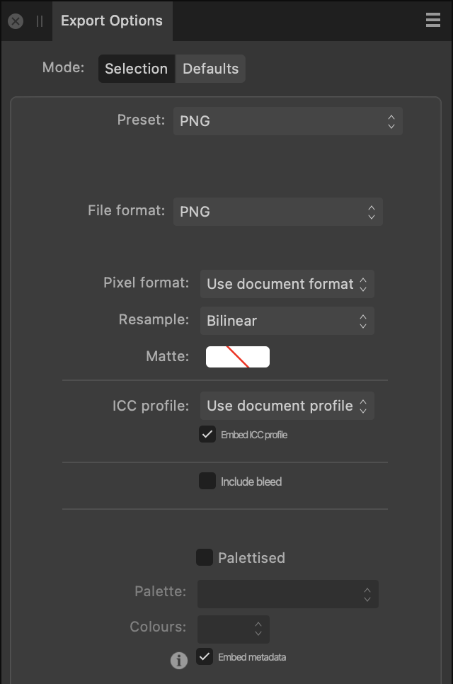

# Export Options panel

Set the export options for a predefined export area using the Export Options panel.

## About the Export Options panel

Once an export area has been defined, the Export Options panel allows you to set specific export attributes for that area. Using the panel, different export areas on the page can have different settings applied. This gives you full control over your exported designs.

You can save custom settings as a preset for future use.

## Settings

Your choice of file format—or preset, which includes a file format—determines which other settings are presented in the panel.

For descriptions of the complete range of settings and their availability by format, see [Export settings](../14-saving-and-sharing/04-export-settings.md).

**

 To save custom settings as a preset:**

1. Set the export options as desired.
2. Click Panel Preferences, and select **Create preset** from the pop-up menu.
3. Enter a name and click **OK**.

The new preset is added to the end of the **Preset** pop-up menu and is also accessible from the [Export dialog](../14-saving-and-sharing/03-export.md).

> **Note:** You can delete and rename custom presets by selecting the appropriate option from the Panel Preferences pop-up menu.

#### SEE ALSO:

- [Exporting using Export Persona](01-exporting-using-export-persona.md)
- [Slices panel](03-slices-panel.md)
- [Export settings](../14-saving-and-sharing/04-export-settings.md)
- [Document setup](../03-get-started/10-document-setup.md)
- [Customising the workspace](../21-workspace/customise/02-workspace.md)
