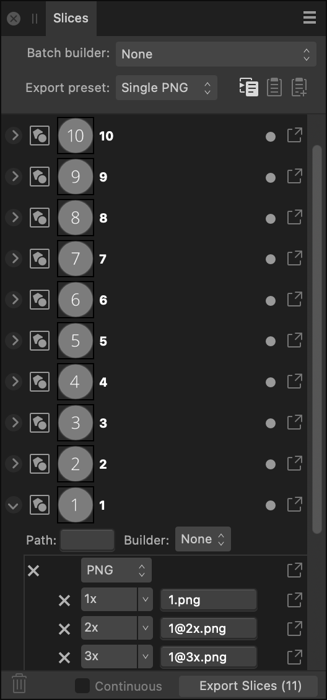

# Slices panel

The Slices panel allows you to export defined areas of your design to universally recognised image formats.

## About the Slices panel

Once an export area has been defined, the **Slices** panel allows you to export the area at various sizes and formats.

The panel can be populated with one or more slices. Each slice possesses a single *export setup*, within which multiple *export formats* (detailing file format and scaling options) may be stored. In turn, each export format can have multiple *export sizes*. This allows different graphics formats, of different sizes, to be exported from each slice simultaneously.

*The Slices panel showing export areas in the document.*

### Options

The following options are available in the panel:

- **Batch builder**—creates Xcode JSON batches from multiple Apple Universal or Application icon slices. For Xcode UI development only.
- **Export preset**—presents slice presets offering common graphics formats and options for Apple app icon design.
- 

   **Copy export setup to clipboard**—copies a selected slice's export setup (including multiple export formats) to clipboard. If you select a graphic-specific export format within the setup, the button can be used to copy that export format to another slice's export setup.
- 

   **Replace export setup from clipboard**—pastes a copied slice's export setup from the clipboard to another selected 'target' slice. A copied export format can be pasted too.
- 

   **Add Export format from clipboard**—pastes a copied export format selected from a slice's export setup and adds it to another slice's export setup. You can copy (and replace) an export format from Panel Preferences.
- 

   Delete—removes the panel item and corresponding export area from the page. The Page panel item cannot be deleted.
- **Continuous**—when selected, slices are re-exported automatically if the content within the slices are modified. This option becomes available once **Export Slices (*n*)** has been clicked and an export folder selected.
- 

   **Export Slices (*n*)**—exports all checked panel items.

> **Tip:** The forward slash (or oblique) character can be used in slice filenames in export setups in the Slices panel. The word preceding the slash will be used to create a containing folder for the file named at the end, when exported using **Export Slices (*n*)**.
>
>
> For example, a PNG slice with a filename in the Slices panel of **assets/img/hero** will create **hero.png** within an **img** folder within an **assets** folder.

### Export Setup Options

The following options are available in the export setup for each slice entry:

- 

   Page—indicates that the export area is the entire page or all artboards.
- 

   Slice—indicates an export area drawn with the Slice Tool.
- 

   Slice (from item)—indicates an export area created from an artboard, layer, group or object.
- Thumbnail—visually indicates the area to be exported.
- Filename—displays the name for the export area. Type directly in the text box to set your own file name. If a name has not been set, unique names are suggested.
- 

   Active/Inactive—when enabled, the area is exported when **Export Slices (*n*)** is clicked at the bottom of the panel.
- 

   Export—exports the area represented by the panel item.
- Path—defines the folder name for the JSON imageset to be written to. For Xcode UI development only.
- Builder—generates supplementary Xcode JSON files along with the exported slices for Apple icons. For Xcode UI development only.

### Export Format Options

You can store multiple formats within every slice's export setup. The following options are available for each format:

- File format—select a file format to be exported from the pop-up menu.
- Size scaling—select scaling options (e.g., 1x, 2x, etc.) to set for the export format.
- Additional properties—lets you choose a custom DPI and a path and filename made up of defined tokens or custom user variables.
- Export—exports the slice using this export format.

#### SEE ALSO:

- [Exporting using Export Persona](01-exporting-using-export-persona.md)
- [Export Options panel](02-export-options-panel.md)
- [Layers panel (Export Persona)](04-layers-panel-export-persona.md)
- [Customising the workspace](../21-workspace/customise/02-workspace.md)
