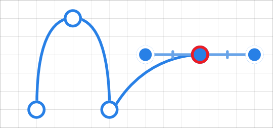

# Grids

A non-printing, non-exporting grid can be displayed in order to help you to create interesting and well-constructed page layouts.

The grid is overlaid over your page to help you align objects. They are grey by default but can be any colour you choose.

Grids can be automatic or fixed—the former (as default) changes the frequency of grid subdivisions as you zoom in/zoom out, the latter always keeps the grid frequency constant (irrespective of zoom level).

Grids work best when combined with snapping, in particular when the Snap to Grid option is enabled. They can be based on any document unit and will line up perfectly with [rulers](08-rulers.md) (when switched on).

**To show or hide the grid:**

- On the **View** menu, select **Show Grid**.

**

 To adjust automatic grid spacing:**

With the **Zoom Tool** selected, do one of the following:

- Zoom in to see smaller grid divisions.
- Zoom out to see larger grid divisions.

At all zoom levels the grid shows as grid 'blocks' further split into grid subdivisions.

**To create a fixed square grid:**

1. From the **View** menu, select **Grid and Axis**.
2. Select **Basic** mode.
3. Set the **Spacing** and **Divisions** values.
4. Click **Close**.

**To customise grid colour:**

1. From the **View** menu, select **Grid and Axis**.
2. Click the **Grid lines** or **Subdivision lines** swatch to display a pop-up panel to set the line colour(s).
3. Drag the sliders to set the opacity of either, or both, line colours.
4. Click **Close**.

> **Note:** For a different colour or opacity for the subdivision lines compared to the main grid lines, click the **Link the grid colours** symbol next to the swatches.

**To create a rectangular grid:**

1. From the **View** menu, select **Grid and Axis**.
2. Select **Advanced** and uncheck **Uniform**.
3. Do one of the following:
   - Set the **Spacing** and **Divisions** for the first and second axis.
  - Select **Fixed aspect ratio**, set the **Spacing** and **Divisions** for the first axis and then set the **Aspect ratio** and **Divisions** for the second axis.
4. Click **Close**.

**To create a fixed angular grid:**

1. From the **View** menu, select **Grid and Axis**.
2. Select **Advanced**.
3. From the **Grid type** pop-up menu, select **Two axis custom**.
4. Set the **Angle** of either axis.
5. Click **Close**.

## Presets

To make grid setup quick and easy, one of several grid presets can be chosen depending on how you plan to work (e.g., for UI design, image placement, etc.).

**To select a preset:**

1. From the **View** menu, select **Grid and Axis**.
2. From the **Preset** pop-up menu, select a preset.

> **Note:** Available grid presets will vary depending on the type of document units used. To use different grid presets, you will have to change document units.

**To customise a preset:**

1. From the **View** menu, select **Grid and Axis**.
2. Select a preset on which to base your new grid options.
3. Check individual options on/off to override the current preset's options.

The options will be in effect immediately.

**

 To save as a custom preset for future use:**

1. Click the button adjacent to the **Preset** pop-up menu.
2. Select **Create preset**.

The custom preset is in effect immediately.

#### SEE ALSO:

- [Snapping](11-snapping.md)
- [Isometric and axonometric grids](05-isometric-and-axonometric-grids.md)
- [Zooming](../03-get-started/13-zooming.md)
- [Zoom Tool](../22-tools/design-tools/26-zoom-tool.md)
- [Document units](../03-get-started/08-document-units.md)
