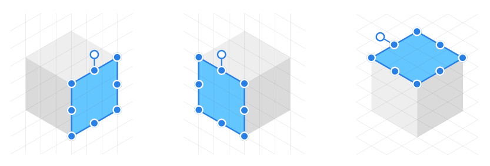
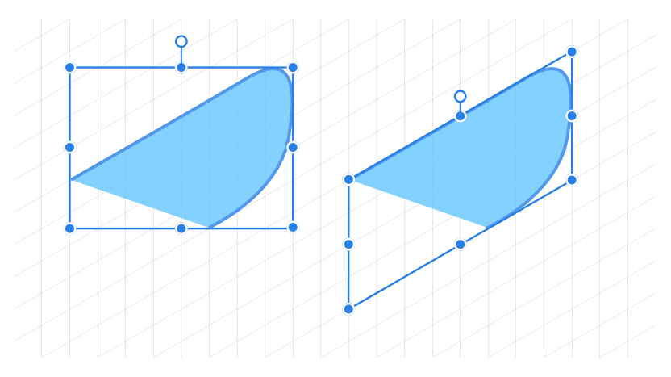
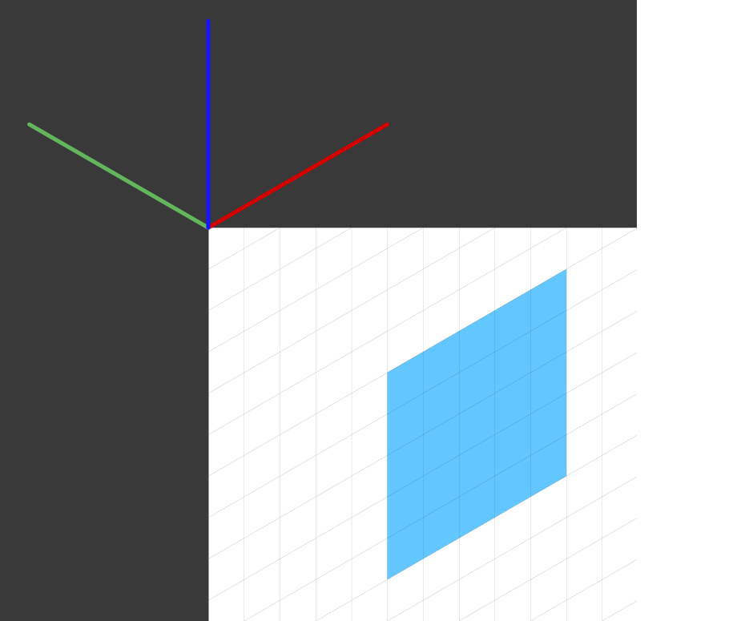
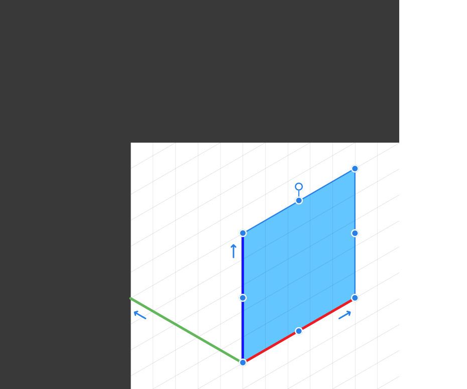
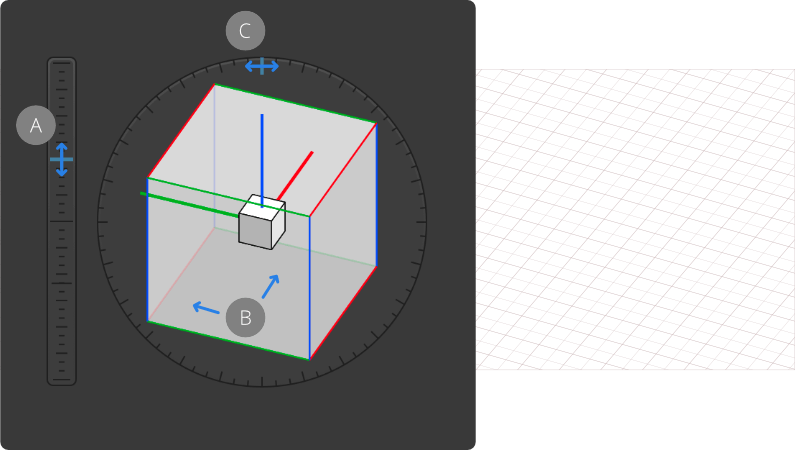

# Isometric and axonometric grids

Affinity Designer makes use of highly customisable isometric and other axonometric grids, perfect for UI/game design, digital design models, mock ups or designs which benefit from this style.

*Isometric drawing.*

## About isometric and axonometric grids

Isometric and other axonometric grids are, by nature, parallel projections. This means that grid lines never converge to a vanishing point as in perspective projections. Perspective projections are not supported in Affinity.

Affinity Designer lets you set up different types of grid in different ways:

 - Isometric (with planes): Easy setup via the **Isometric** panel.
- Trimetric left and isometric (with planes): as presets from **View>Grid and Axis**.
- Dimetric, trimetric, oblique, triangular: from **View>Grid and Axis** (Advanced tab's **Grid type** option).

For any axonometric grids, planes can be switched between, using the apostrophe key ('), so you can apply in-plane transforms on front, side and top planes in turn.

*Front, Side and Top planes of isometric grid showing selected object transformed to fit in-plane.*

Once a grid is set up, you can draw geometric shapes, art text and gradients directly on the active plane and selectively transform curves, closed shapes and placed images to the plane of your choice using the Move Tool.

### About snapping controls

Grids work best when combined with snapping. Object handles and curve nodes snap precisely to any grid line and line intersections.

Grids can be based on any document unit, shown when switching on the rulers.

### Using Cycle Selection boxes

When drawing curves on plane, take advantage of the **Cycle Selection Box** setting on the **Select** Menu. Its 'Planar bounds' option transforms the curve’s selection box (not the object) to that of the current plane, allowing easier positioning/snapping of curves to the grid. Once Planar bounds is set, fitting the curve to a different plane subsequently will change the planar box too.

*Selection box (not object) changed to 'Planar bounds'.*

For out-of-plane editing, choose a **Cycle Selection Box** setting of ‘Base Box’ or ‘Regular Bounds’.

**To create an isometric grid:**

1. From the **View** menu, select **Isometric** from the **Studio** options to display the **Isometric** panel.
2. Click **Modify Grid**.
3. On the now displayed **Grid and Snapping Axis** dialog, check **Show Grid**.

> **Tip:** If you haven't set up a grid previously, you'll be prompted to initially modify the settings (e.g., grid Spacing) for your new isometric grid; you can then make the grid visible.
>
>
> If an isometric or other type of axonometric grid was already set up, the you won't be prompted for settings.

**

 

 

 To jump between grid planes:**

Do one of the following:

- From the **Isometric** panel, click **Front**, **Side** or **Top**.
- Press the apostrophe (')  to cycle between planes.

> **Note:** This plane-swapping behaviour is a fundamental principle in drawing the 'faces' of an object (Front, Side and then Top plane).

**To set the grid spacing:**

- On the **Grid and Snapping Axis** dialog, set the **Spacing** and **Divisions** values.

**

 To set grid snapping:**

1. From the Toolbar, select **Snapping**.
2. Select a **Preset**, e.g. Curve drawing, ensuring that **Snap to grid** is also checked.

This ensures that objects will fit accurately to grid lines.

**

 To draw geometric shapes directly on the grid:**

1. From the **Isometric** panel, enable **Edit in plane**.
2. With a shape tool selected, drag out a chosen shape. You can snap your shape to the grid on creation when dragging initially from any grid intersecion or when repositioning and/or scaling the shape.

**

 To fit two-dimensional objects to plane:**

1. Select a curve, closed shape, artistic text or image.
2. On the **Isometric** panel, choose a plane (Front, Side, Top) to send the object to.
3. On the same panel, select **Fit to plane**.

> **Tip:** If you [clip](../07-layers/10-layer-clipping.md) objects to parent objects before fitting them to the plane of your choice, these child objects will automatically follow the parent object's transformation on plane.

> **Tip:** If including text on any plane, ensure artistic text is used rather than frame text. The frame properties of frame text means that transformation on plane is not exact.

**

 

 

 

 To transform any object on the grid:**

- Select the object in the plane, then do one of the following:
   - On the **Isometric** panel, ensure the correct Current plane is set (must be the same plane as that which the object was originally drawn on), then use the panel's 180° flip and 90° rotate options.
  - To rotate the object on the page, drag its Rotation Handle clockwise or anti-clockwise. Press the `Shift`  to rotate in 15° increments.

> **Note:** If you wish to rotate objects using Rotation Handles, ensure **Edit in plane** is enabled.

**To change other isometric grid settings:**

- On the **Isometric** panel, select **Grid Settings**. From here, you can:
   - Switch on the grid origin (axis editing handles)
  - Add intermediate grid angles for snapping or constraining to.
  - Add an axis perpendicular to the current plane for snapping or constraining to.
  - Set the grid colour and transparency

## Advanced grids

The **Grid and Snapping Axis** dialog's Advanced tab is ideal for laying out advanced axonometric grids as well as two-dimensional fixed grids and isometric grids.

Instead of the commonly used isometric grid set up via the **Isometric** panel, a choice of other project grid presets can also be selected (e.g., dimetric, triangular); you can even create custom axonometric grids with options for enabling plane sets, grid sizing, custom aspect ratios and angles for more advanced use.

If you're looking beyond the presets such as isometric you can customise the grid to your liking.

### Grid origin

The grid origin is a point at which axes meet and is the corner of the logical plane. The origin is shown as a set of axis handles (in red, green and blue) which can be extended or repositioned on the page.

For most axonometric grids, the axis handles remain locked in relation to each other but can all be lengthened by the same amount simultaneously to set grid spacing.

The origin is set by dragging the grid origin (top left corner of page) by its intersection point and positioning it on the page. As you change between planes, the handles on the active plane will be shown thicker.

You can snap the grid origin to an object on any plane and equally snap an object to a fixed grid origin.

## Setting up additional axis

You can introduce additional angles and an extra axis to your grid that gives you extra options for snapping and constraining object edges, corners and curve nodes to.

- **Intermediate angles**—adds additional angles between axes that can be snapped or constrained to.
- **Intermediate divisions**—Divides the angle between axes by a set number (set to 4 for 22.5° divisions for origami).
- **Plane perpendicular axis**—creates another axis perpendicular to any active plane on axonometric grids. **Create plane set** must be enabled.
- **Horizontal axis**—adds an additional horizontal axis for constraining or snapping.
- **Vertical axis**—adds an additional vertical axis for constraining or snapping.

## Understanding axis and snapping colours

You may see the following colours which indicate different axes while snapping or constraining:

- Red line: First axis (X axis on basic square grid)
- Green line: Second axis (Y axis on basic square grid)
- Blue line: Third axis (Z axis; axonometric grids)
- Yellow node: Intersection point
- Purple node: construction snap
- Orange node: intermediate angles

**To set your advanced grid:**

1. From the **View** menu, select **Grid and Axis**.
2. Do one of the following:
   - Select a Parallel perspective preset from the **Presets** pop-up menu.
  - Click **Advanced**, then from the **Grid type** pop-up menu, select a grid, then edit its settings in the dialog.

**To view and position the grid origin:**

1. From the **Grid and Snapping Axis** dialog, check **Show axis editing handles**. By default, the grid origin will show at the top-left corner of your page.
2. Drag the grid origin intersection to a point on your page, e.g. a corner of a geometric shape.

> **Tip:** Reset the origin by double-clicking the intersection.

**To set the grid spacing:**

- On the page, drag the end of one of the red, green or blue axis-editing handles outwards or inwards to size the grid. If snapped to an object you can size the grid to the object.

## Custom grids using Cube mode

Cube mode offers a natural approach to setting up an axonometric grid. You can alter the elevation, orientation and roll of the cube, which automatically repositions your grid on the page.
*Changing the Elevation (A), Orientation (B) and Roll (C) when using the grid Cube mode.*

### Grid cube advantages

- Visually preview and configure the grid using a controllable cube.
- Keeps the logical scale to be the same as 2D objects where axes are foreshortened rather than relying on mathematical values to define axis length.

**To set up an axonometric grid using Cube mode:**

1. From the **View** menu, select **Grid and Axis**.
2. Set the **Mode** to be 'Cube'.
3. Set the **Cube Scale** which is the edge size of the cube and any **Divisions** value for all axes.
4. Change the Elevation (**E**) by dragging the blue marker on the vertical slider next to the cube (or input a specific E value), using available snapping points if needed.
5. On the cube, adjust the cube Orientation (**O**) by dragging left or right (or enter an O value). The angle and the lengths of the grid axes are derived from the cube orientation.
6. On the outer ring gauge around the cube, drag the blue marker to adjust the Roll (**R**) setting.

> **Note:** For a true isometric grid, a snapping point at 35.3° OR -35.3° can be combined with an O (Orientation) angle of 45°.

> **Note:** ### Modifier keys
>
>
> The following modifier keys can be used:
>
>
> - The `Alt`  temporarily overrides snapping.
> - The `Shift`  adjusts Orientation and Roll in 5° increments.

## Custom grids

For custom grids, any grid origin's axis editing handle’s length and direction can be changed in relation to and independently of other handles.

**To create a custom grid:**

1. From the **Grid and Snapping Axis** dialog, select either **Two axis custom** or **Triangular custom**.
2. Enable **Uniform** to keep grid spacing the same across axes.
3. Enable **Create plane set** to activate and configure the **Up** axis.
4. Enable **Fixed aspect ratio** to configure the aspect ratio between axes. Disable to keep the same aspect ratios for Second and Up axes.
5. Do one of the following:
   - Configure **Spacing**, **Division** and **Angle** setting for First, Second and Up axes.
     With the **Move Tool** enabled, drag an axis editing handle on the grid origin inwards or outwards, changing its angle.
     > **Note:** ### Modifier keys
    >
    >
    > As you adjust the handles, the following modifier keys can be used:
    >
    >
    > - The `Shift`  locks axis angles so length (i.e. grid spacing) is changed and not angles.
    > - The `Cmd`  changes the angle of the moving handle (not length) while locking other axis angles.
6. Click **Close**.

#### SEE ALSO:

- [Draw curves and shapes](../05-drawing-curves-and-shapes/02-draw-curves-and-shapes.md)
- [Draw and edit shapes](../05-drawing-curves-and-shapes/06-draw-and-edit-shapes.md)
- [Grids](04-grids.md)
- [Snapping](11-snapping.md)
- [Rulers](08-rulers.md)
- [Layer clipping](../07-layers/10-layer-clipping.md)
