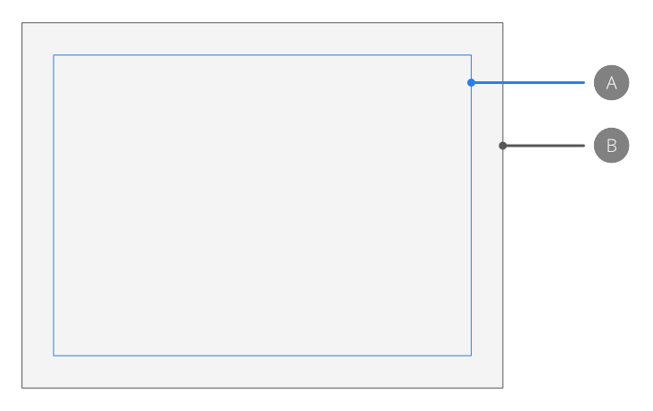

# Margins

The margin is the area between the main content of the page and the page edges (or spread and spread edges). Margins are shown as a blue solid line by default, but this colour can be changed.

*Default margin (A) in relation to page edge (B).*

Page margins give an indication of the extent of the page that will be printed when using a desktop printer. Design elements positioned outside the margins may not be printed.

Margin positions can be customised manually or using the settings of an installed printer. They are non-printing and non-exporting.

> **Note:** Margins can also be used for snapping to when creating or moving objects.

> **Tip:** If you intend on exporting your design, rather than printing it directly, you can design with complete freedom from margins. If this is the case, you may wish to switch off the margins.

**To change page margins:**

1. From the default context toolbar, or **File** menu, select **Document Setup**.
2. In the pop-up dialog, select the **Margins** tab.
3. Select the **Include margins** option.
4. Do one of the following:
   - Set the **Left Margin**, **Right Margin**, **Top Margin**, and **Bottom Margin**.
  - Click the colour swatch to display a pop-up panel to update the margin colour.

**To hide/show margins:**

- From the **View** menu, deselect/select **Show Margins**. A check mark is displayed next to the menu item when the margins are visible.

**To change the colour of margins:**

- From the **File** menu, select **Document Setup**.
- From the **Margins** tab, click the colour swatch to display a pop-up panel to update the margin colour.

#### SEE ALSO:

- [New Document](../03-get-started/02-create-new-documents.md)
- [Snapping](11-snapping.md)
- [Guides](06-ruler-and-column-guides.md)
