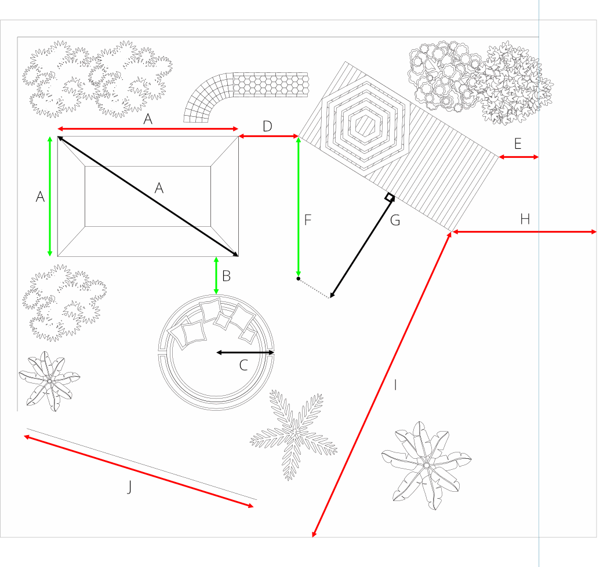
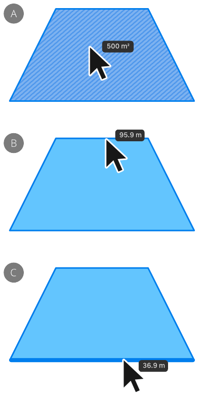
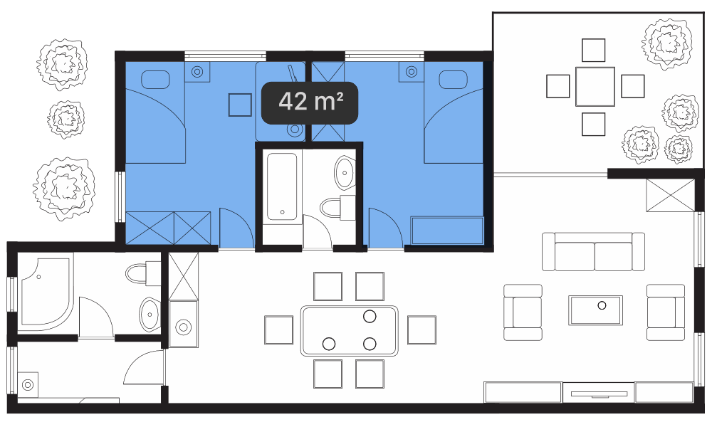
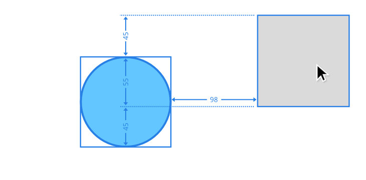
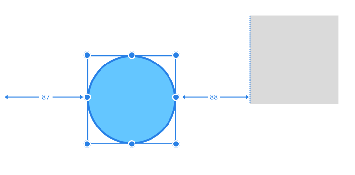

# Measuring

Measuring lets you display the distance between points, objects and page elements on the page—using either a dedicated Measure Tool or a hover over feature. An Area Tool additionally measures the area of one or more objects, plus the perimeter of a shape and open curve lengths.

## Measuring with the Measure Tool

The Measure Tool lets you accurately measure the distance between a fixed point and an object's edge, corner, centre or at the intersection of two objects vertically, horizontally or diagonally. Curves and page elements such as page centre, edge and edges (corners) can also be measured to. The reverse is also true—you can measure from any page element to any point or an object's edge, corner or at object intersection. You can even measure between placed guides.

***Measure Tool**: (A) Point - Point (horizontally, vertically, diagonally), (B) Point - Curve, (C) Point - Centre, (D) Point - Line, (E) Point - Guide, (F) Point - Page centre, (G) Point - Page centre (tangent; with projection line), (H) Point - Page edge and (I) Point - Page edge at Page centre and (J) Along a diagonal straight line.*

The Measure Tool is also plane-aware, so measurement can be made along the axes of isometric or axonometric grids.

## Measuring with the Area Tool

This tool displays the area, total perimeter length or specific straight-line segment lengths of an object when you hover over it. For area measurements, linear hatching indicates the targeted object along with the object's area as an overlaid readout.

*Single-object area/perimeter measurement with the **Area Tool**: (A) Area of a closed object, (B) Perimeter of a object, (C) Straight-line 'cusped' segment length on the object.*

You can also calculate the area of multiple objects by clicking an initial object and using modifier keys to include further objects. A blue highlight indicates objects included in the total selection, while dark-blue linear hatching (not shown), on hover over of an object in that selection, identifies it as the 'active' object and reports just its area measurement.

*Multi-object area measurement with the **Area Tool** by selection with the `Cmd` and `Shift` s pressed.*

## Measuring between objects

Using the `Cmd`  with the Move Tool and shape tools will display measurements between objects as you move your cursor around the page. These relate to the distance between the selected object(s) and other object (or page elements) and will update dynamically as the cursor moves.

*'Hover over' measurements displaying the size of the gaps between the selected circle and the square.*

*'Hover over' measurements displayed when a circle is nudged to the right using the right arrow key.*

For example, with a shape selected, measurements will show the distance, using labelled arrows, between the shape and:
 - another shape, when the cursor is positioned over that target shape.
- the page edges, when the cursor is positioned over a blank portion of the page.

The measurement will then update as the cursor moves over an object to show the size of the horizontal and vertical gaps between this object and the selection.

> **Note:** Measurements are not persistent, are non-printable and are not saved with your document.

**

 To display distance measurements:**

1. Select the **Measure Tool**.
2. Do one of the following:
   - Click-drag from a start point to an end point.
  - Click for a start point, then click for an end point.

Use the `Esc`  to clear any measurement.

**

 To display area measurements:**

1. With the **Move Tool** active, select the object(s).
2. From the Measure Tool flyout, select the **Area Tool**.
3. Hover over the target object shown in blue. For multi-object areas, any one of the selected objects (shown temporarily in blue) will report the total area on hover over, as well as the currently hovered-over object area (in blue linear hatching).

> **Tip:** Area measurements will also be reported on the context toolbar while the selection remains in place, including the total area of selected objects.

> **Note:** If you click a blue selected area it will be removed from the total area calculation found on the context toolbar. On hover over this excluded area will highlight in red.

**

 To display perimeter measurements:**

1. With the **Move Tool** active, select the object.
2. From the Measure Tool flyout, select the **Area Tool**.
3. Do one of the following:
   - 

     For an object's full perimeter length: With the context toolbar's **Perimeter Mode** set to **Full Edges**, hover over the target object's perimeter. The thicker blue highlight will report the object's full perimeter length.
  - 

     For a specific straight-line segment length(s): With the context toolbar's **Perimeter Mode** set to **Cusped Segments**, hover over a specific segment to report just that segment's length along with the perimeter length. Optionally, you can click the segment (turning it red) and click additional adjacent or non-adjacent segments to make multi-segment perimeter measurements, reported as **Selected edges** on the context toolbar.

> **Tip:** Perimeter measurement will also be reported on the context toolbar while the selection remains in place—Total perimeter length is shown, along with length excluding any holes.

**To display measurements on hover over:**

- With the **Move Tool** active, select one or more objects and then hold down `Cmd` while moving the cursor over a target object.

The target object will display measurements from the selected object to the target object (if hovered over) or page element (if no objects are hovered over).

> **Note:** ### Modifier keys
>
>
> When using the Measure Tool, the following modifier keys can be used while the measurement is being drawn:
>
>
> - The `Shift`  constrains the measurement line to 45° intervals. Tangents and equal bisecting angles will also be displayed while the key is pressed. Holding the mouse button down for a slightly longer duration will, on dragging, additionally draw a dashed projection line, whose axis can be toggled by pressing the ~ .
> - Use either up or down arrow keys to constrain measurements to vertical; left or right arrow keys to constrain to horizontal.
> - For keyboard's with numeric keypads, numeric keys can change measurement directions as follows:
>    - 0 —reverts back to unconstrained.
>   - 1 —constrain to 45°.
>   - 2 —constrain to vertical.
>   - 3 —constrain to 135°.
>   - 4 —constrain to horizontal.
>   - 5 —constrain to equal angles.
> - The `Alt`  temporarily switches off snapping.

#### SEE ALSO:

- [Snapping](11-snapping.md)
- [Drawing scale](../03-get-started/09-drawing-scale.md)
- [Dynamic guides](10-dynamic-guides.md)
