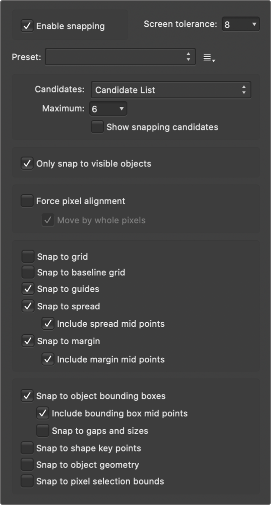

# Snapping

Snapping simplifies the positioning of new and existing objects by 'magnetising' moved or resized objects to other objects or document elements.

Snapping causes images, brush strokes, lines, shapes, and selection areas to align to nearby grid lines, guides, margins, artboards or spreads, or any combination of these. You can also snap to object bounding boxes, key points on shapes, and to an object's geometry. Text can also snap to the baseline of other text (the first line only for text frames) and artistic text objects can snap to the height of previously created artistic text.

To help understand snapping behaviour, coloured dynamic guides and target nodes display when you snap to objects. The colours used are:

- Red line: Object snaps to target horizontally.
- Green line: Object snaps to target vertically.
- Yellow node: Object snaps to shape's key points (often centres) or geometry.
- Blue line: Object snaps to third plane when using triangular projection grid.
- Orange line: Object snaps to target horizontally or vertically if a projection grid is active.

> **Note:** Dynamic guides work in conjunction with snapping to provide a visual aid when aligning. Dynamic guides also include labels which report the distance between the snapping objects (measured in the document's set units).

> **Tip:** For web graphic development, you may wish to use [Force Pixel Alignment](14-force-pixel-alignment.md). This complements any active snapping settings.

*The range of snapping options.*

## Snapping candidates

Snapping candidates are page objects which are available for you to snap to. You can specify which objects are used in the snap, and eliminate the ones you are not interested in. Alternatively, you can construct your document in a more hierarchical way by using **Immediate layers**. You can set how candidates are created using the following settings:

- **Candidate List**—limits the number of objects which are snapping candidates to the number you set. Creating a new object, or hovering over an existing object, designates it as a snapping candidate in this case. Only the active snapping candidates can be snapped to.
- **Immediate layers**—limits the number of candidates to only the current layer, layers that are siblings or the immediate parent layer.
- **Immediate layers and children**—limits the number of candidates to the objects on the current layer and any of the layer's subordinate child layers.
- **All layers**—does not limit the number of snapping candidates in the document.

**

 To activate/deactivate snapping:**

- Click **Snapping** on the main toolbar.

**To temporarily override snapping:**

- Press the `Alt`  while you're positioning an object. Snapping won't occur while the  is depressed.

**To exclude an object from being a snapping candidate:**

- On the **Layers** panel, `Click`-click the object entry and select **Exclude From Snapping**.

A symbol, 

, appears on the layer entry to indicate this exclusion.

## Snapping presets

A powerful and comprehensive set of snapping options are available to you. To make snapping setup quick and easy, one of several snapping presets can be chosen which group recommended snapping options according to how you plan to work (e.g., for UI design, curve drawing, etc.).

**

 To select a snapping preset:**

1. Click the **Snapping** option's arrow.
2. From the **Preset** pop-up menu, select a preset.

**

 To customise a snapping preset:**

1. Click the **Snapping** option's arrow.
2. Select a preset on which to base your new snapping options.
3. Check individual options on/off to override the current preset's options.

The options will be in effect immediately.

**

 To save as a custom preset for future use:**

1. Click the button adjacent to the **Presets** pop-up menu.
2. Select **Create preset**.

The custom preset is in effect immediately.

### Snapping options

Individual snapping options can be switched on or off to suit your needs, drawing style, and the project you are working on. The preset that you initially adopted will be customised in the process.

The following options are available from the pop-up dialog:

- **Screen tolerance**—controls the distance you have to be to an object before snapping occurs.
- **Enable snapping**—when checked, objects will snap to specified criteria. This must be selected to change other options.
- **Presets**—Select a preset which is a grouping of snapping options for specific ways of working.
   - Page layouts—for designs to be printed, where snapping to placed guides, margins, and spreads is important.
  - Page layouts with objects—as above but with additional object-to-object alignment.
  - Object creation—perfect for simple object-to-object alignment to bounding boxes and their midpoints, plus for aligning some shapes to key points. Key points are automatically added points on some objects, e.g. where a shape's corner is made rounded, key points are placed at the start and end of the rounded corner.
  - Curve drawing—the setup for non-geometric use (i.e., drawing with the pen/pencil/brush tools).
  - UI design—for UI/web design for pixel accuracy when using snapping to fixed guides and grid.
- **Candidates**—sets how candidates are created. Select from the pop-up menu.
   - **Maximum**—limits the number of active candidates when **Candidate List** is selected (see above). If you reach this limit, new candidates replace older candidates in chronological order.
  - **Show snapping candidates**—when checked, highlights the active snapping candidates, i.e. objects that can be snapped to by prior selection or hover over. Candidates will display a 'purple halo'.
- **Only snap to visible objects**—when checked, only visible objects are snapped to.
- **Force pixel alignment**—identical to the Toolbar option—see [Force Pixel Alignment](14-force-pixel-alignment.md).
   - **Move by whole pixels**—identical to the Toolbar option—see [Force Pixel Alignment](14-force-pixel-alignment.md).
- **Snap to grid**—when checked, content snaps to a line grid (if switched on from the **View** menu). Not available when using Force Pixel Alignment.
- **Snap to guides**—when checked, content snaps to guides (if switched on from the **View** menu).
- **Snap to spread**—when checked, content snaps to the edge of the document (ignoring margins).
   - **Include spread mid points**—when checked, content snaps to vertical or horizontal centre of the page. This option is only available if the above option is selected.
- **Snap to margin**—when checked, content snaps to page margins (if switched on from the **View** menu).
   - **Include margin mid points**—when checked, content snaps to vertical or horizontal centre of the page margin. This option is only available if the above option is selected.
- **Snap to object bounding boxes**—when checked, objects can be aligned based on its bounding box.
   - **Include bounding box mid points**—when checked, objects snap to vertical or horizontal centre of a target object. This option is only available if the above option is selected.
  - **Snap to gaps and sizes**—when checked, arrows represent matched gaps between snapping candidates and matched horizontal and/or vertical sizes.
- **Snap to shape key points**—when checked, objects can be aligned to key points on shapes, such as the start and end of a rounded corner.
- **Snap to object geometry**—when checked, curves can be snapped to vertices and not simply to the bounding box or key points. Vertices are object corners or intersections, such as the points of a star, within a shape's bounding box.
- **Snap to pixel selection bounds**—when checked, objects can be snapped to the bounds of a pixel selection. For example, using the Flood Select Tool, a pixel selection drawn over image 'edges', which would otherwise not be snappable, will expose those edges for snapping.

> **Note:** Snapping always snaps to the currently set measurement unit as defined in **File>Document Setup**.

> **Note:** You can also access the above settings from the **Snapping** option via the **View** menu.

> **Warning:** If you have a document with a high number of objects or layers and activate the **All layers** snapping candidate option, you may experience performance issues when moving or resizing objects due to the shear number of snapping candidates.

#### SEE ALSO:

- [Force Pixel Alignment](14-force-pixel-alignment.md)
- [Dynamic guides](10-dynamic-guides.md)
- [Grids](04-grids.md)
- [Guides](06-ruler-and-column-guides.md)
- [Margins](07-margins.md)
