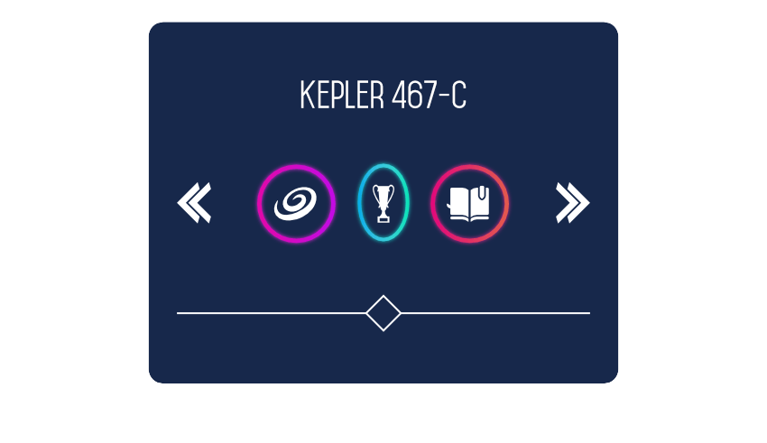
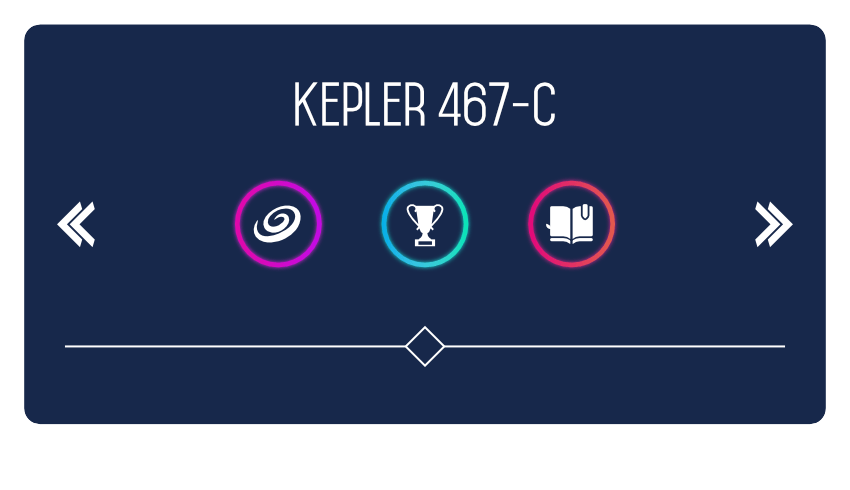

# Constraints

A child object can be prevented from being scaled when resizing its parent and be anchored to its parent in different ways. This ensures that designs can be presented in different layouts quickly and easily. The feature is perfect for designing UI mockups, e.g., to envisage how dialogs can be resized without affecting the position of every dialog control.

*Scaling has been disabled for all objects except the text, trophy button and the top lines. Anchoring has been applied to most objects except the text and trophy button.*

Using constraints gives you the freedom to design without worrying that design rework will be adversely affected by unwanted object rescaling. By controlling selectively which objects will/won't be scaled and anchored, your design will always respond correctly to scaling.

Constraints only work in parent - child object relationships, i.e. where a parent object (container) contains nested content. A child object's scaling and anchoring is always in relation its container. For example, in UI design, a device mockup could have parent - child object relationships such as artboard - panel, panel - button, etc.

Constraining is exclusively carried out from the **Constraints** panel. The panel controls:

- horizontal and vertical scaling in relation to its parent's size
- anchoring of an object by its top, left, right and/or bottom edge in relation to its parent object's equivalent edge.

By default, nested content will scale when its container is resized. A child object is *not* anchored by default.

## Locking aspect ratio

To prevent a child object losing its aspect ratio when its parent is scaled disproportionately, you can set it to **Min Fit** or **Max Fit**.

- 

   Min Fit—when the parent object is resized disproportionately, the child object may scale so it always fits within its parent object (if unanchored). Use on text to ensure it always fully displays.
- 

   Max Fit—when the parent object is resized disproportionately, the child object may scale. The child object can become bigger than its parent object, potentially clipping content from view. Using a web banner mockup as an example, a child object (e.g., an image) will always fully fill the containing banner area (avoiding white letterboxing) but may be subject to clipping.

In both cases, if the parent object is resized proportionately, the child object will also scale proportionally.

> **Note:** If a child object is set to **Min Fit** and its parent object is resized wider, the child object will not scale. However, if the parent object is later made taller, the child object will begin scale to honour its original aspect ratio and size with respect to it parent.

**To prevent a child object from scaling:**

1. Select a child object.
2. On the **Constraints** panel, click the horizontal or vertical solid double arrow (or both) in the panel's inner square. A greyed-out dashed arrow means that scaling won't occur when its parent object is resized.

> **Note:** An artboard, when resized, will not scale its contents by default. To allow constraints to operate as for other parent - child objects, uncheck **Lock Children** on the context toolbar.

**To anchor a child object to its parent's boundaries:**

1. Select a child object.
2. On the **Constraints** panel, click a greyed-out dashed line between the inner and outer square to anchor the object to its parent in that direction (top, bottom, left, or right). A solid line means anchoring is being applied.

**To maintain a child object's aspect ratio:**

1. Select a child object.
2. On the **Constraints** panel, click **Min Fit** or **Max Fit**.

#### SEE ALSO:

- [Transforming objects](../08-object-control/16-transforming-objects.md)
- [Constraints panel](../23-panels/07-constraints-panel.md)
