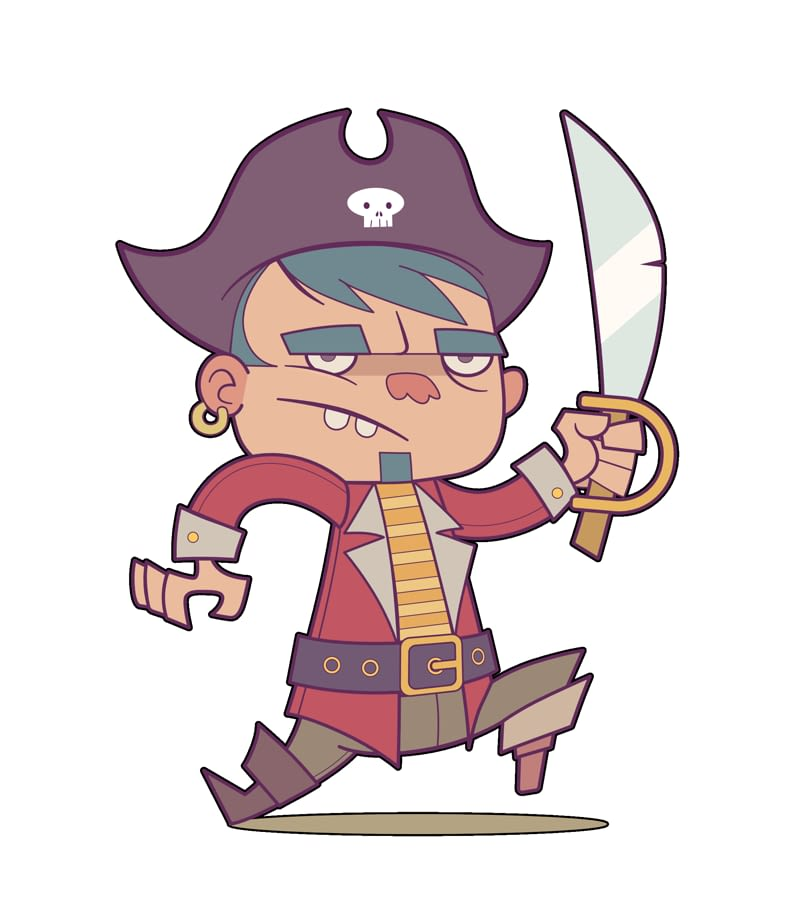

# Outline

The Outline effect is used to add a coloured outline to objects.

### Settings

The following settings are shown on the **Quick FX** panel:

- **Colour**—sets the colour of the effect. Click the colour box to choose the colour from the pop-up panel.
- **Opacity**—controls the transparency of the effect.
- **Radius**—controls the extent of the effect.
- 

   **Layer Effects**—provides access to the **Layer Effects** dialog for more advanced settings and controls.

The following advanced settings can be adjusted in the **Layer Effects** dialog:

- **Blend mode**—changes how the effect interacts with content below the current layer.
- **Alignment**—sets the position of the outline. Select from the pop-up menu.
- **Fill style**—sets the type of fill applied to the outline.
- **Scale with Object**—when selected, the effect scales in proportion to the object if the object is resized. If this option is off, the effect's scale remains unchanged when the object is resized.
- **Fill Opacity**—sets the opacity of the layer contents without affecting the applied effects.

> **Tip:** The **Fill style** includes the **Contour** type. Contour applies a gradient fill which runs from the inner to the outer edge of the stroke width.

#### SEE ALSO:

- [Using layer effects](01-using-layer-effects.md)
- [Gradient and bitmap fills](../06-colour/12-gradient-and-bitmap-fills.md)
- [Quick FX panel](../23-panels/14-quick-fx-panel.md)
