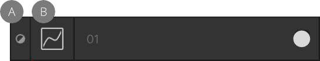
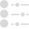
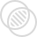
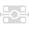

# Applying adjustments

There are a range of adjustments which can be applied to your design as a new layer for creative or corrective purposes.

Adjustments are applied from the **Layers** panel and most include customisable settings alongside general adjustment options. Once applied, they can be identified as both an adjustment and a specific adjustment type by using unique symbols.

*Curves adjustment layer (named 01) indicating it is an adjustment (A) and a Curves adjustment type (B).*

**Available adjustments:**

- 

  [Black & White](02-black-and-white-adjustment.md)
- 

  [Brightness / Contrast](03-brightness-contrast-adjustment.md)
- 

  [Channel Mixer](04-channel-mixer-adjustment.md)
- 

  [Colour Balance](05-colour-balance-adjustment.md)
- 

  [Curves](06-curves-adjustment.md)
- 

  [Exposure](07-exposure-adjustment.md)
- 

  [Gradient Map](08-gradient-map-adjustment.md)
- 

  [HSL](09-hsl-adjustment.md)
- 

  [Invert](10-invert-adjustment.md)
- 

  [Lens Filter](11-lens-filter-adjustment.md)
- 

  [Levels](12-levels-adjustment.md)
- 

  [LUT](13-lut-adjustment.md)
- 

  [Normals](../30-additional-pages/01-adjustment-normals.md)
- 

  [OCIO (OpenColorIO)](14-opencolorio-adjustment.md)
- 

  [Posterise](15-posterise-adjustment.md)
- 

  [Recolour](16-recolour-adjustment.md)
- 

  [Selective Colour](17-selective-colour-adjustment.md)
- 

  [Shadows / Highlights](18-shadows-highlights-adjustment.md)
- 

  [Soft Proof](19-soft-proof-adjustment.md)
- 

  [Split Toning](20-split-toning-adjustment.md)
- 

  [Threshold](21-threshold-adjustment.md)
- 

  [Vibrance](22-vibrance-adjustment.md)
- 

  [White Balance](23-white-balance-adjustment.md)

Adjustment layers only affect objects in the layer which are below them. Alternatively, you can make an adjustment a child of an object, thereby affecting that object only.

Some adjustments (i.e., Curves, Levels, or Channel Mixer) can be made in any colour space independently of the document colour space.

### Settings

The following general settings are available from all adjustment dialogs:

- **Merge**—merges the current adjustment layer with the layer immediately below it in the layer order.
- **Delete**—closes the dialog and deletes the adjustment layer, removing the adjustment from the image.
- **Reset**—reverts all dialog settings to default.
- **Opacity**—how see through the adjustment layer is.
- **Blend mode**—changes how the applied pixels interact with existing pixels on the layer below. Choose mode type from a pop-up menu.
- 

   **Blend Ranges**—click to access a dialog for setting the blend ranges, blend gamma and antialiasing settings for the selected layer.

> **Note:** You can reset any adjustment setting back to its default by double-clicking on its slider handle.

> **Note:** Not all adjustments have a dedicated dialog or customisable settings.

**

 To apply an adjustment:**

1. On the **Layers** panel, do one of the following:
   - Select a layer to add the adjustment as a child of the layer. It will affect all objects on the selected layer.
  - Select a layer object, group or image to add the adjustment to the item, affecting just that item only.
  - Deselect all items to add the adjustment at the top of the layer stack, applying the adjustment to all items below it (the entire spread).
2. Click **Adjustments** and select an adjustment from the pop-up menu.
3. If a dialog appears for the adjustment, follow the steps below:
   1. Adjust the settings in the dialog.
  2. Close the dialog.

> **Note:** Adjustments are also available from the **Layer** menu's **New Adjustment** submenu.

#### SEE ALSO:

- [Using adjustment layers](../07-layers/12-using-adjustment-layers.md)
