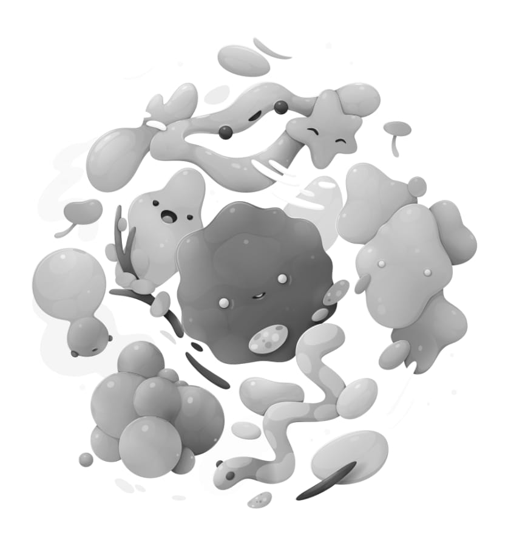

# Black and White adjustment

Convert a colour image to monochrome while maintaining full control over how individual colours are converted.

This adjustment comes with a handy **Picker** setting which allows you to target a colour in the document and adjust the applicable slider.

> **Tip:** You may wish to apply a colour tone, such as sepia, to the resulting greyscale image. To do this, you could use a **Recolour** adjustment.

> **Note:** You can also create black and white images using the **HSL**, **Gradient Map**, and **Threshold** adjustments.

### Settings

The following settings can be adjusted in the dialog:

- The sliders control the lightness value of the named colour areas of the image. Drag the slider to the left to darken areas of the named colour, drag the slider to the right to lighten them.
- **Picker**—allows you to drag on the image to modify the adjustment. The initial click will identify the predominant colour, dragging left will darken areas of the identified colour while dragging right will lighten them. The corresponding slider will be updated.

#### SEE ALSO:

- [Applying adjustments](01-applying-adjustments.md)
- [Recolour adjustment](16-recolour-adjustment.md)
- [HSL adjustment](09-hsl-adjustment.md)
- [Gradient Map adjustment](08-gradient-map-adjustment.md)
- [Threshold adjustment](21-threshold-adjustment.md)
