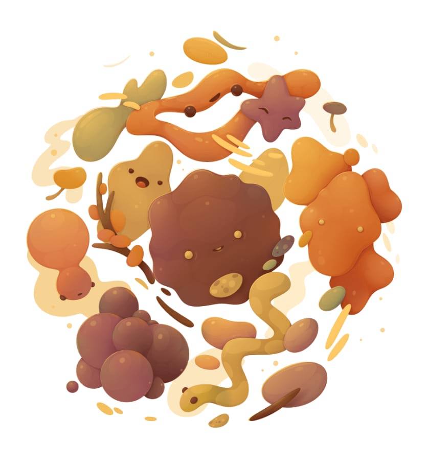

# Gradient map adjustment

The Gradient Map adjustment maps the equivalent greyscale range of an image to a specified colour gradient. This provides an effective (and creative) way of recolouring an image.

### Settings

For dialog settings, see the [Gradient and bitmap fills](../06-colour/12-gradient-and-bitmap-fills.md) topic.

> **Tip:** To create a black and white image, ensure the gradient contains only greyscale values.

#### SEE ALSO:

- [Gradient and bitmap fills](../06-colour/12-gradient-and-bitmap-fills.md)
- [Applying adjustments](01-applying-adjustments.md)
- [Recolour adjustment](16-recolour-adjustment.md)
- [Black and White adjustment](02-black-and-white-adjustment.md)
