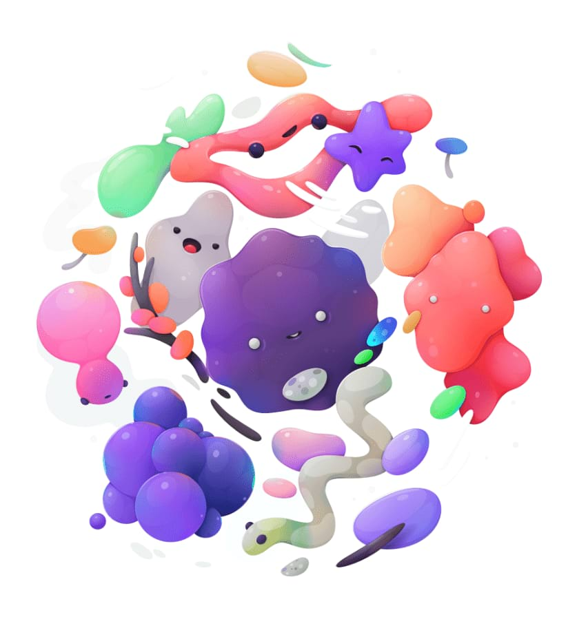

# HSL adjustment

Fine-tune the colours in your image, or even completely change them, by modifying the hue, saturation and luminosity (lightness).

### Settings

The following settings can be adjusted:

- **HSV**—when checked, uses the Hue Saturation Value (HSV) model instead of Hue Saturation Lightness (HSL). The Saturation Shift and Luminosity Shift sliders behave differently between the two models.
- **Colour Wheel**—when using a particular channel, allows you to determine the range of colours affected by that channel (e.g., **Greens**) using four nodes located on the wheel.
- **Channel**—represented as coloured circles under the wheel. Click the first (Master; multi-coloured) to alter all colours at once or click any other coloured circles to enable a specific colour set (e.g., Reds).
- **Picker**—allows you to sample a specific colour from your image on which to base your adjustment. The currently active solid colour circle will be updated after picking; the Master circle cannot be colour picked.
- **Hue Shift**—controls the colour tint of pixels in the image. Drag the slider to shift the colours through the spectrum.
- **Saturation Shift**—controls the intensity of the colours in the image. Drag the slider to the left to decrease colour intensity, drag to the right to increase it.
- **Luminosity Shift**—controls the overall brightness of the image. Drag the slider to the left to decrease brightness, drag to the right to increase it.

> **Note:** ### Using the **Channel** nodes
>
>
> If choosing a specific channel, you can adjust that colour's range in different ways:
>
>
> - Drag on an individual node to reposition it around the colour circle.
> - Drag the black line that connects the coloured nodes. The central line between inside nodes moves all four nodes simultaneously and in relation to each other. The black line between either outer node and its adjacent node moves just that pair of nodes independent of the other node pairing.

> **Tip:** To create a desaturated (black and white) image, position the **Saturation Shift** slider to the far left with the **Master** channel selected.

#### SEE ALSO:

- [Applying adjustments](01-applying-adjustments.md)
- [Recolour adjustment](16-recolour-adjustment.md)
- [Black and White adjustment](02-black-and-white-adjustment.md)
