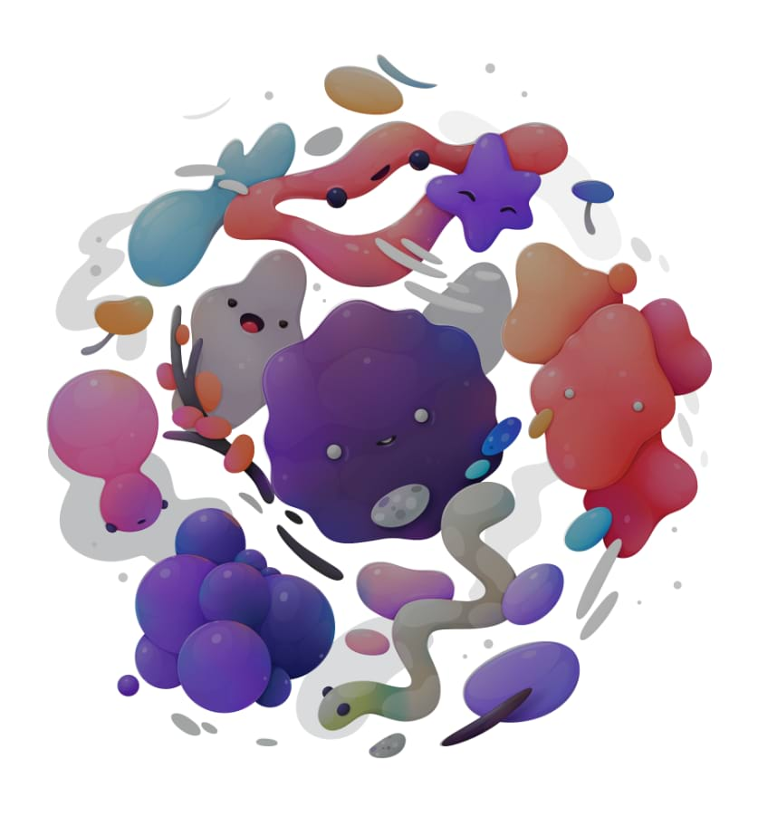

# Levels adjustment

Adjust the tonal values and colour balance of an image by setting the black point, white point, and gamma. Adjusting the levels affects the pixel distribution within an image.

> **Tip:** Adjustments can be made in any colour mode, regardless of the document's current colour mode.

### Settings

The following settings can be adjusted in the dialog:

- Select a colour mode from the first pop-up menu.
- Specify a single colour channel to apply the adjustment to, including the layer's alpha channel. **Master** (the default choice) applies the adjustment to all colour channels*, excluding alpha channel*.
- **Black Level**—determines the range of pixels in the image considered to be pure black. Drag the slider to the right to include pixels in the range (thereby increasing shadows), drag to the left to exclude pixels (thereby reducing shadows).
- **White Level**—determines the range of pixels in the image considered to be pure white. Drag the slider to the left to include pixels in the range (thereby increasing highlights), drag to the right to exclude pixels (thereby reducing highlights).
- **Gamma**—determines the distribution of mid-tone pixels in the image. Drag the slider to the left to redistribute pixels towards the black point, drag to the right to redistribute towards the white point.
- **Output Black Level**—remaps the output level of absolute black. Moving the slider to the right makes the design look more pale and washed out.
- **Output White Level**—remaps the output level of absolute white. Moving the slider to the left lessens the intensity of highlights of the design.

> **Tip:** To create a negative-style (inverted) image, position the **Black Level** slider further to the right than the **White Level**.

> **Note:** Holding `Alt` while modifying the Black Level or White Level provides a realtime clipping preview.

#### SEE ALSO:

- [Applying adjustments](01-applying-adjustments.md)
- [Curves adjustment](06-curves-adjustment.md)
- [Brightness / Contrast adjustment](03-brightness-contrast-adjustment.md)
- [Shadows / Highlights adjustment](18-shadows-highlights-adjustment.md)
- [Invert adjustment](10-invert-adjustment.md)
