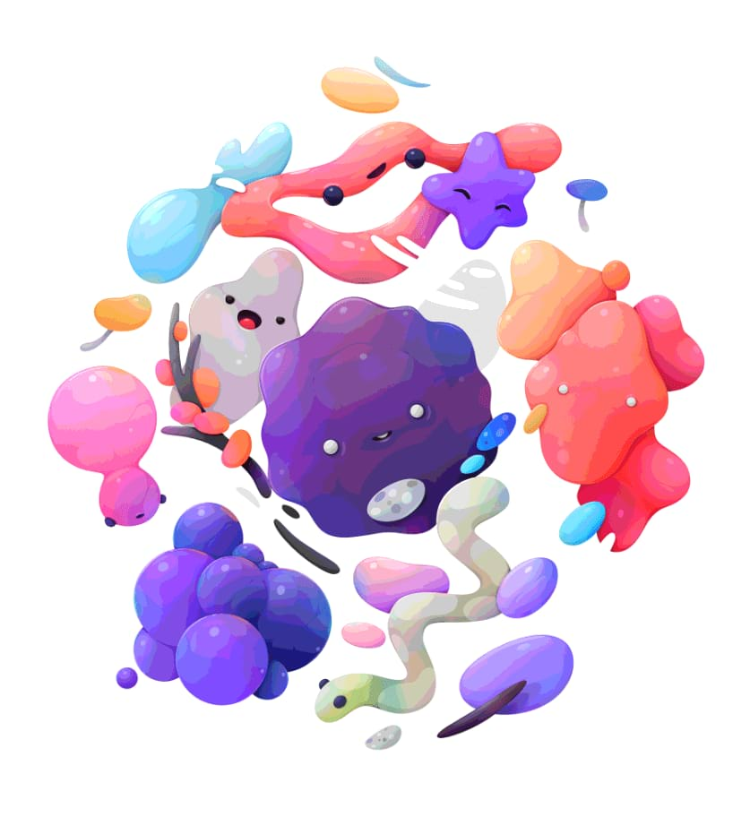

# Posterise adjustment

Creates large, flat areas of colour or tone in your images.

*Before and after adjustment applied.*

### Settings

The following settings can be adjusted in the dialog:

- **Posterise Levels**—controls the number of coloured areas produced and the complexity of the resulting image. Drag the slider to the left to decrease the number of coloured areas (thereby simplifying image layout), drag to the right to increase coloured areas (thereby giving a more complex image layout).

> **Note:** The number displayed in the dialog represents the **level** of complexity rather than the number of resulting colours.

#### SEE ALSO:

- [Applying adjustments](01-applying-adjustments.md)
