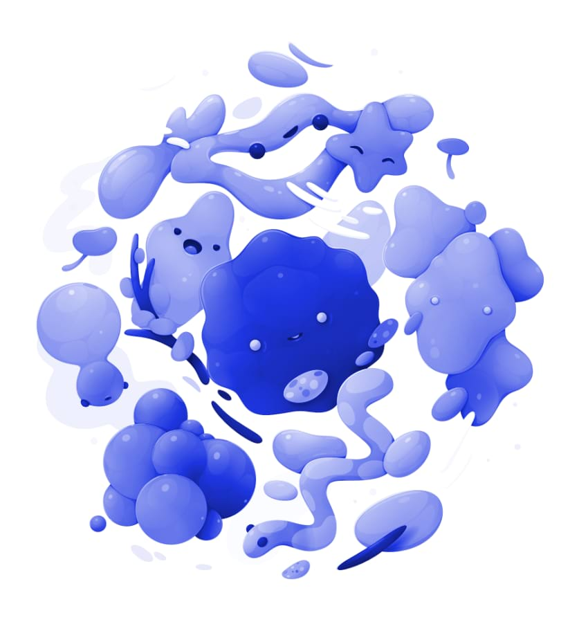

# Recolour adjustment

Create a monochrome image using the full spectrum of colours.

### Settings

The following settings can be adjusted in the dialog:

- **Hue**—controls the colour tint applied to the image. Drag the slider to shift the tint through the spectrum.
- **Saturation**—controls the intensity of the image's colour. Drag the slider to the left to decrease colour intensity, drag to the right to increase it.
- **Lightness**—controls the overall brightness of the image. Drag the slider to the left to decrease brightness, drag to the right to increase brightness.

> **Tip:** ### Creating black and white and sepia images:
>
>
> - To create a desaturated (black and white) image, position the **Saturation** slider to the far left.
> - To create a sepia image, position the **Hue** slider anywhere around the orange section of the spectrum and position the **Saturation** slider anywhere left of the centre.

#### SEE ALSO:

- [Applying adjustments](01-applying-adjustments.md)
- [Black and White adjustment](02-black-and-white-adjustment.md)
- [HSL adjustment](09-hsl-adjustment.md)
