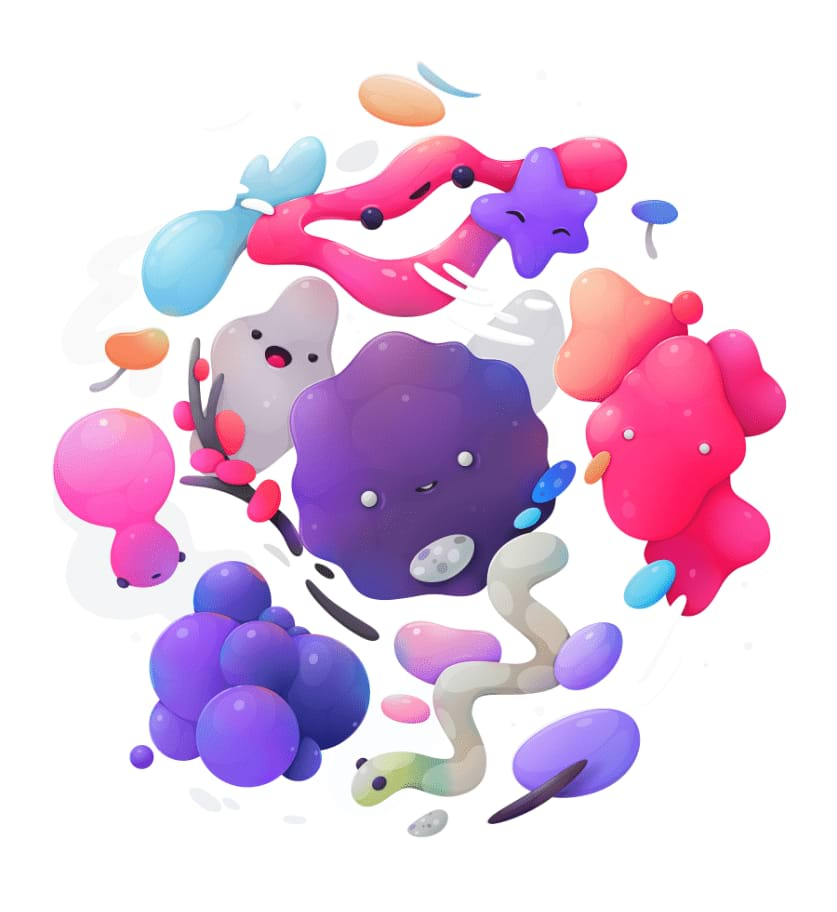

# Selective Colour adjustment

The Selective Colour adjustment provides a way to subtly adjust and enhance colours in your image on an individual channel basis. It makes a useful tool for colour balance corrections.

> **Note:** This adjustment produces subtle effects. Even at the extreme ends of the adjustment, you shouldn't see many artefacts or saturated pixels. If you intend to make extreme adjustments, such as completely recolouring pixels, then the HSL adjustment will be more suitable.

### Settings

The following settings can be adjusted in the dialog:

- **Colour**—determines the colour to be adjusted. Select from the pop-up menu.
- **Relative**—when selected (default), colour is added or subtracted in proportion to the amount of that colour present in the source pixels, giving a more natural effect. If this option is off, colours are added or subtracted based on the absolute percentage specified, regardless of the how much of that colour is present in the image.
- The sliders control the levels of the named colour in the selected **Colour**. Drag the slider to the left to decrease the level of the named colour, drag the slider to the right to increase it.

#### SEE ALSO:

- [Applying adjustments](01-applying-adjustments.md)
- [HSL adjustment](09-hsl-adjustment.md)
