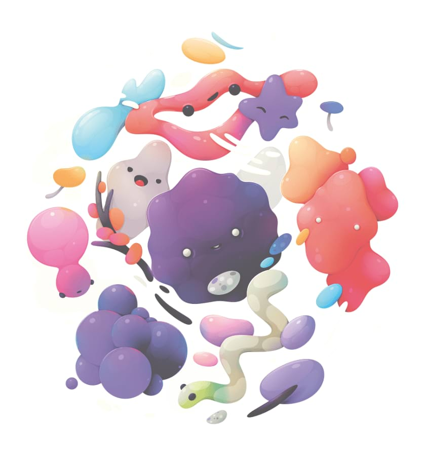

# Soft Proof adjustment

Preview the effect of creating an output for a specific colour space or device.

This adjustment allows you to preview different output options for your photo or design. It can also be used creatively for tonal effects. As it behaves like a standard adjustment layer, it must be hidden or removed before exporting or sending to print, otherwise its effect will be included in the output.

### Settings

The following settings can be adjusted in the dialog:

- **Proof Profile**—determines the colour profile used. Select from the menu or use the up/down arrow keys to cycle through options.
- **Rendering Intent**—specifies how the adjustment converts 'source' colours to the destination colour space using different intents. Select from the following:
   - **Absolute colourimetric**—adjusted colours are scaled to the white point of the source colour space.
  - **Perceptual**—for out of gamut colours, the visual relationship between colours is preserved so they are perceived as natural to the human eye, even though the colour values may change.
  - **Relative colourimetric**—shifts colours after making comparison between the highlights of a source colour space and the destination colour space, while minimising desaturation.
- **Black point compensation**—when selected (default), the design's black point is adjusted to honour the current contrast within the current proof profile. If this option is off, the design's black point is not adjusted and image contrast may not be honoured.
- **Gamut check**—when selected, RGB colours without a CMYK equivalent will display as grey.

#### SEE ALSO:

- [Applying adjustments](01-applying-adjustments.md)
- [Export Persona](../15-exporting/01-exporting-using-export-persona.md)
- [Export](../14-saving-and-sharing/03-export.md)
- [Print](../14-saving-and-sharing/05-print.md)
