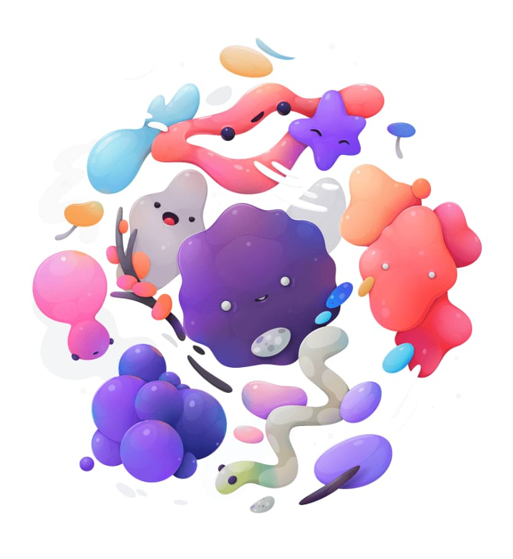
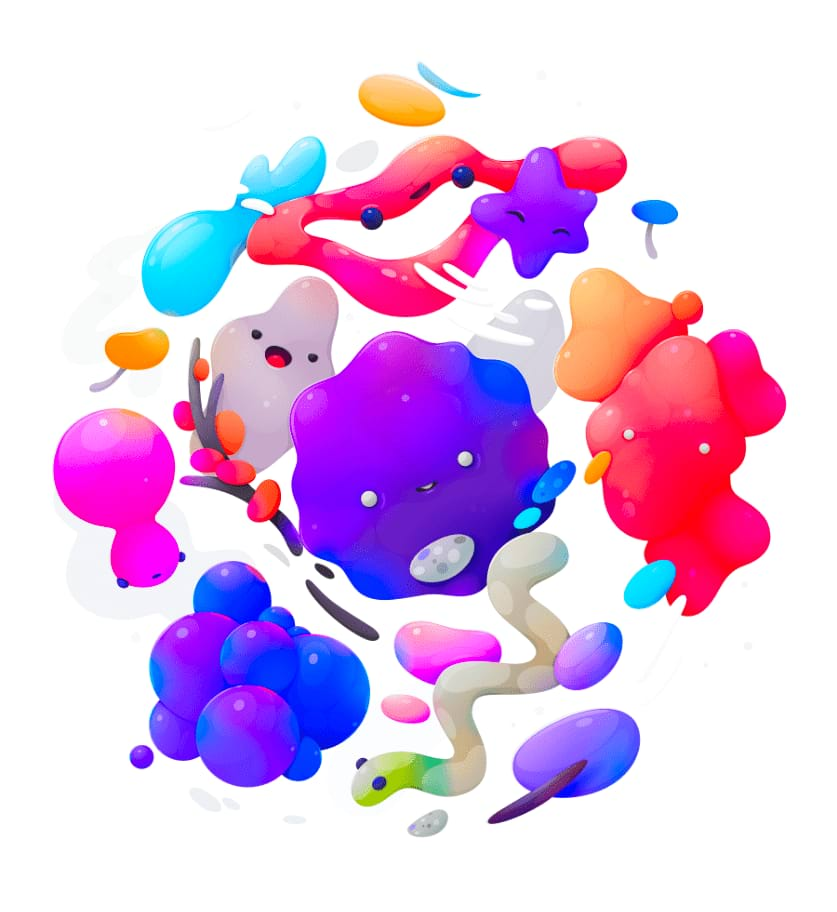

# Vibrance adjustment

Adjusts the intensity of colours in your image.

### Settings

The following settings can be adjusted in the dialog:

- **Vibrance**—controls the intensity of colours in the image without clipping them. Drag the slider to the left to reduce colour intensity, drag the slider to the right to boost subtle colour intensity while minimising the over-saturation (clipping) of more intense colours. Skin tones are also preserved to retain a natural appearance.
- **Saturation**—controls the intensity of colours in the image equally, allowing for possible clipping. Drag the slider to the left to reduce colour intensity, drag the slider to the right to boost colour intensity without regard to clipping, allowing for much more intense results.

#### SEE ALSO:

- [Applying adjustments](01-applying-adjustments.md)
