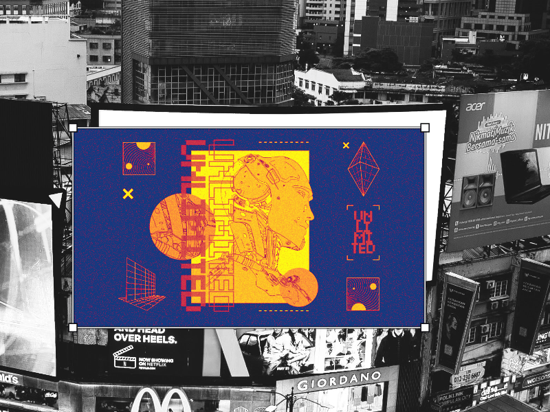
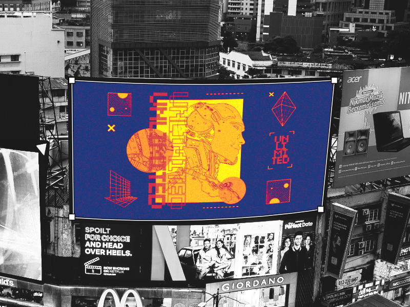

# 

 Mesh Warp

The Mesh Warp filter can be used to distort specific areas of an image without affecting other areas.

For example, it can be used for dramatic warping effects on a text, shapes, vector curves or even brush strokes amongst other design elements.

*Warping a vector graphic.*

## About Live Mesh Warp

This filter is applied on its own layer as a non-destructive, live filter. It can be accessed from the Pixel Persona, via the **Layer** menu, by selecting from the **New Live Filter Layer**>**Mesh Warp**.

### Settings:

The following settings can be adjusted from the context toolbar:

- **Destination/Source**—mode option to manipulate just the grid (Source) or both grid and the object simultaneously (Destination).
- **Synchronise**—makes the destination mesh match the source mesh.
- **Reset**—restores the grid to a uniform rectangular shape. Nodes which have been added are distributed evenly across the grid.
- **Hide Mesh**/**Show Mesh**—hides and shows the grid and the nodes.
- **Convert**—switches the selected node to **Sharp** or **Smooth**.

#### SEE ALSO:

- [Warping objects](../08-object-control/09-warping-objects.md)
- [Transforming objects](../08-object-control/16-transforming-objects.md)
