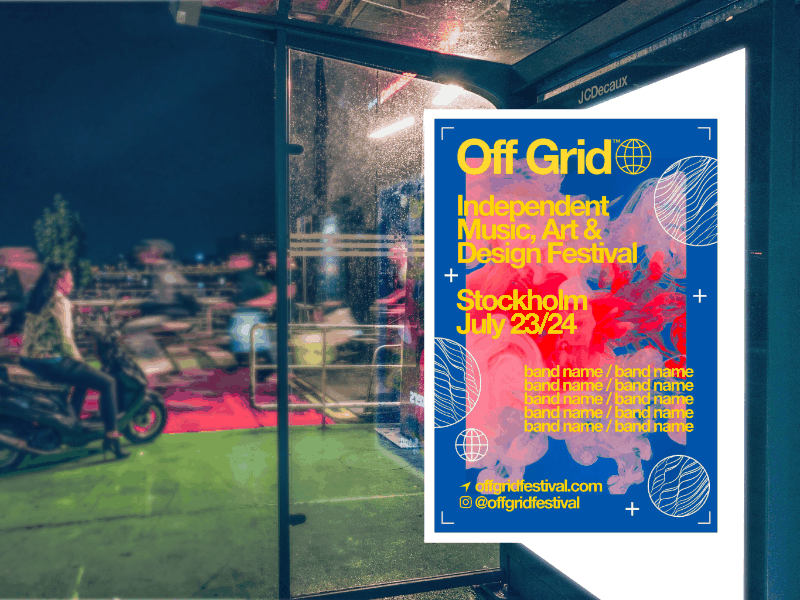
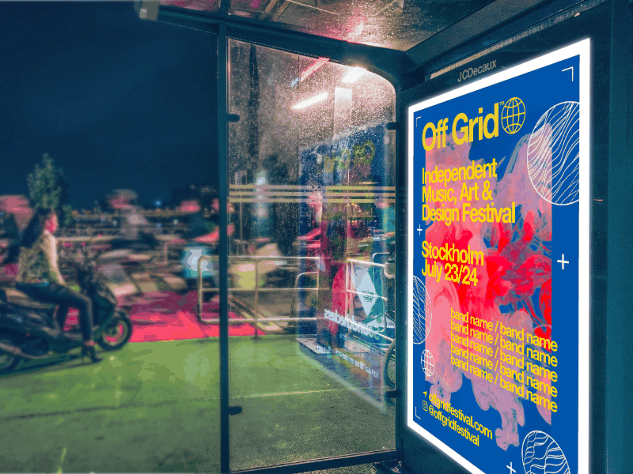

# 

 Live Perspective

The Perspective filter can be used to manipulate compositions to achieve surreal results or to apply creative effects that change the viewers' perception of a piece.

*Using the Perspective filter to alter shapes and text.*

## About Live Perspective

The Perspective filter can be adjusted in single plane mode. It can be accessed from the Pixel Persona, via the **Layer** menu, by selecting from the **New Live Filter Layer**>**Perspective**.

### Settings

The following settings can be adjusted from the dialog:

- **Preserve Alpha**—when enabled, object edges are not subject to perspective transformation.
- **Merge**—merges the current perspective transformation with the layer immediately below it in the layer order.
- **Delete**—removes the live perspective filter and its layer.
- **Reset**—restores the operation and its options to a starting point.
- **Mode**—an option to manipulate just the grid (Source) or both grid and the object simultaneously (Destination).
- **Show Grid**—hides/shows the grid.
- 

   **Rotate Clockwise**—rotates the selected object(s) to the right by one 90° increment.
- 

   **Rotate Anti-clockwise**—rotates the selected object(s) to the left by one 90° increment.

#### SEE ALSO:

- [Warping objects](../08-object-control/09-warping-objects.md)
- [Transforming objects](../08-object-control/16-transforming-objects.md)
