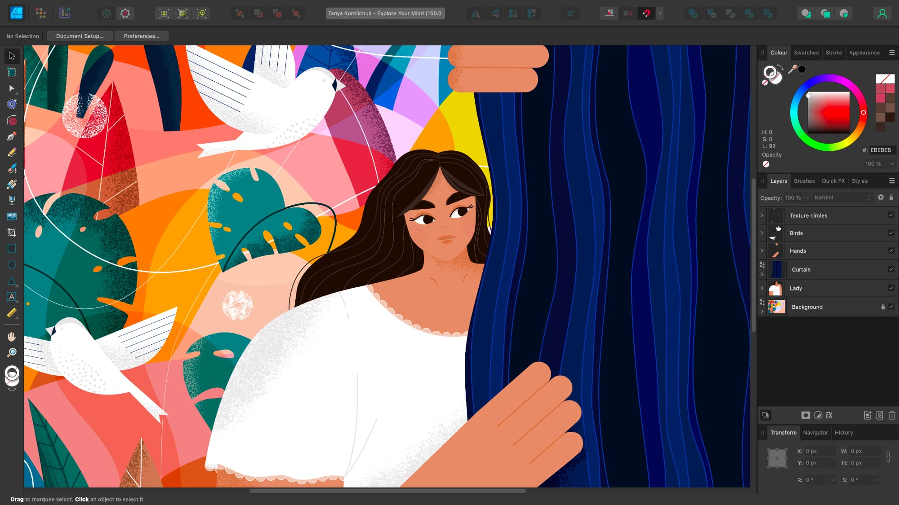
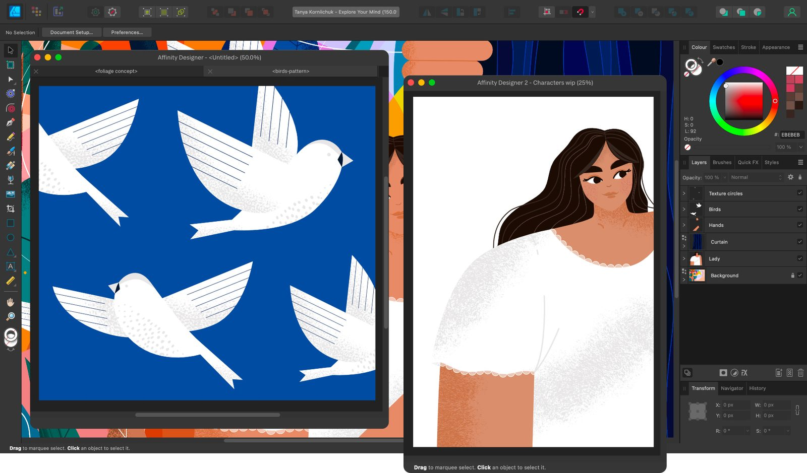

# Application and document windows

When the Affinity app first opens, the workspace will be presented in a single application window. This means that all panels will be neatly docked together so that all controls are at your fingertips and easy to find. Any opened document will be docked in the workspace and will occupy the central document view.

> **Note:** This default workspace view is customisable. You can rearrange Studio panels and panel groups, or undock them to have floating panels. For multiple opened documents, you can float the tabbed documents in their own document windows.

## About app windows

Affinity apps offer both maximised/full screen and windowed views.

### Maximised/Full screen

**macOS:**

In this view, your Affinity app is effectively maximised to its own desktop, giving you every available pixel to work with.

### Windowed

When the Affinity app opens for the very first time, it will display in a window which fits approximately 95% of your screen. You can change the size of this window at any time by dragging the window corners.

> **Note:** Your preferred window size is remembered between sessions.

**Windows:**

When maximised, the Affinity app will fill the entire available screen space, excluding the area occupied by the taskbar at the bottom.

### Windowed

When the Affinity app opens for the very first time, it will display in a window which fills approximately three-quarters of the screen. You can change the size of this window at any time.

> **Note:** Your preference for Windowed or Maximised mode will be remembered between sessions. Your preferred window size is also remembered between sessions.

## About 'tearable' document windows

While there is only one app window, you can have one or more document windows per open document. By default, documents are docked to the workspace (viewed as tabs under the context toolbar) but these can be 'torn' away from the tab bar to make them independent undocked, floating windows.

**To resize an application or document window:**

- Position the cursor at an edge or corner of the window and drag inwards or outwards to decrease or increase the window size, respectively.

**macOS:**

**To switch the application to be full screen:**

Do one of the following:

- 

   On the title bar, click the green button on the left.
- From the **Window** menu, select **Toggle Full Screen**.

> **Note:** 
>
>  Click the green button to exit full screen. The Menu bar hosting the button is not visible in full screen view. However, it is accessible by moving the pointer to the upper edge of the screen.

**Windows:**

**To switch the application to be full screen:**

Do one of the following:

- On the title bar, click the Affinity icon on the left and select **Maximise**.
- 

   On the title bar, click the Maximise icon on the right.

**macOS:**

**To minimise or zoom (maximise) a document window:**

Do one of the following:

- 

   

   On the title bar, click the minimise or zoom button on the left.
- From the **Window** menu, select either **Minimise** or **Zoom**.

**Windows:**

**To minimise or zoom (maximise) a document window:**

Do one of the following:

- On the title bar, click the Affinity icon on the left and select **Minimise** or **Maximise**.
- 

   

   On the title bar, click the Minimise or Maximise icon on the right.

**Windows:**

**To restore an application or document window from maximised:**

Do one of the following:

- On the title bar, click the Affinity icon on the left and select **Restore**.
- 

   On the title bar, click the Restore icon on the right.

When switching back to being windowed, the window will return to the size it was at before being maximised.

**macOS:**

**To float docked documents:**

Do one of the following:

- Drag a document tab to the workspace and release.
- From the **Window** menu, select **Float View to Window**.

**Windows:**

**To float docked documents:**

Do one of the following:

- Drag an open document tab to the workspace and release.
- From the **Window** menu, select **Arrange>Float** for a displayed open document, or **Arrange>Float All** for all docked documents.

**To dock a document window with another:**

- Drag a floating document window's title bar onto another document window's tab bar (under the title bar), and drop when the destination window becomes tinted blue.

**To redock multiple floating windows:**

Do one of the following:

- Drag a floating document window's title bar onto the tab bar (or top of workspace), and drop when the main document view becomes tinted blue.
- From the **Window** menu, select **Merge All Windows**.
- From the **Window** menu, select **Arrange>Dock** for a floating selected document, or **Arrange>Dock All** for all floating documents.

**macOS:**

**

 To move floating windows:**

- Hover over the floating window's green button, then choose **Move Window to Left Side of Screen** or **Move Window to Left Side of Screen** from the menu.

**

 To tile the application window to the left or right of the screen:**

1. Hover over the green button on the application title bar until an additional set of options appear.
2. Choose **Tile Window to Left of Screen** or **Tile Window to Right of Screen** to display the Affinity app on the left or right side of the screen.

Other application windows you have open may be arranged on the remaining side of the screen by using equivalent options on those apps.

#### SEE ALSO:

- [Interface Visual Reference](../02-user-interface/01-interface-visual-reference.md)
- [Customising the workspace](customise/02-workspace.md)
