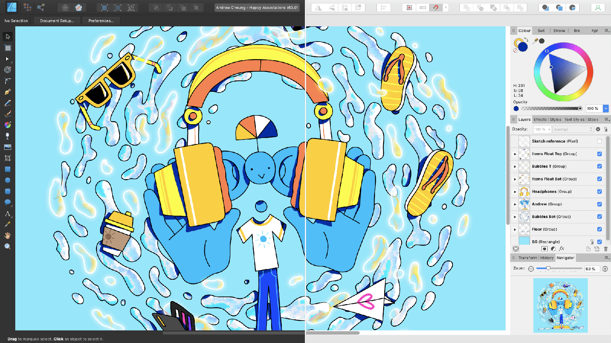
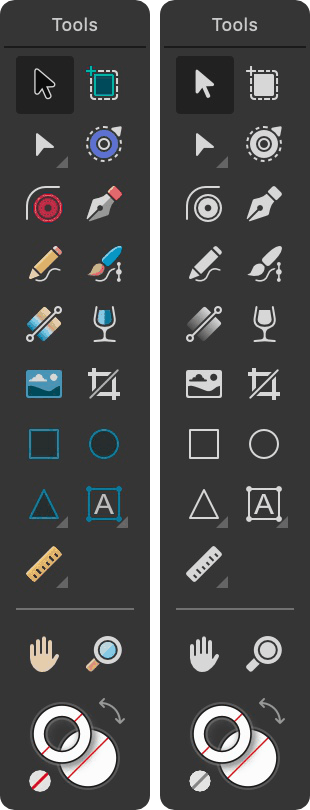

# Changing the UI appearance

Affinity Designer has a dark User Interface (UI) by default. This makes it easier to accurately view and edit the colours in your designs. However, you can swap the UI interface from dark to light (and vice versa), adjust the background greyscale or the overall Gamma for contrast changes, and switch from colourised to monochromatic iconography in the UI.

**To change the UI from dark to light (or vice versa):**

1. Choose **Affinity Designer**>**Settings** (or >**Preferences**).
2. Choose **Edit**>**Settings** (or >**Preferences**).
3. Click the **User Interface** label.
4. For **UI Style**, choose Dark, Light, or Default OS (Mac only).

**To change the UI background, Artboard background or Gamma level:**

1. Choose **Affinity Designer**>**Settings** (or >**Preferences**).
2. Choose **Edit**>**Settings** (or >**Preferences**).
3. Click the **User Interface** label.
4. Drag the sliders to set the **Background Grey level**, **Artboard Background Grey level** and/or **UI Gamma** level.

**To display monochromatic icons in the UI:**

1. Choose **Affinity Designer>Settings** (or **>Preferences**).
2. Choose **Edit>Settings**.
3. Click the **User Interface** label.
4. For **Icon Style**, choose Mono.

#### SEE ALSO:

- [Application and document windows](01-application-and-document-windows.md)
- [Customising the workspace](customise/02-workspace.md)
- [Customising the Toolbar](customise/04-toolbar.md)
