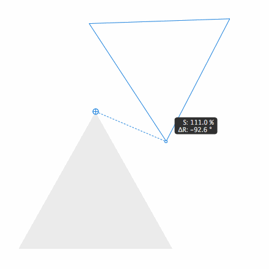
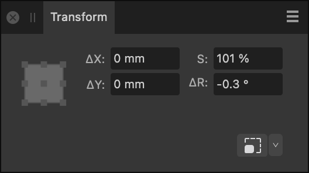

# 

 Point Transform Tool

The **Point Transform Tool** lets you scale or rotate a selected object from any of its nodes about a positioned transform origin.

*The object is snapped to another object and rotated about its transform origin.*

The Point Transform Tool is especially suited to transforming an object about not only its own geometry (or chosen node) but that of another object's geometry. The point of transformation is always the object's transform origin which can be repositioned onto the same or other object's geometry (or chosen node); you can drag from a node on your object to transform about the transform origin.

When dragging an object with the **Point Transform Tool** active, a dotted line relative to the transform origin will appear, and the object's relative scale and rotation will be displayed as it is transformed.

> **Tip:** While using the tool, the **Transform** panel changes functionality to report distances (ΔX, ΔY), scaling percentage (S) and angle (ΔR) pertinent to the current transform.

*The Transform panel with the Point Transform Tool active.*

> **Tip:** Tool shortcut : `F`

The **Point Transform Tool** can also be used in isometric (axonometric) transformations, relative to the current grid plane. This makes it easy to snap to a specific point, scale between the focal point and any given point on a curve, and rotate a point on the curve about a given focal point. The transform centre point uses the same point assigned by the custom transform origin in the **Move Tool**, but can easily be assigned to a new point on the curve by clicking or dragging it to any location.

### Settings

The following settings can be adjusted from the context toolbar:

- **Fill**—click the colour swatch to display a pop-up panel to update fill colour.
- **Stroke**—click the colour swatch to display a pop-up panel to update stroke colour.
- **Stroke properties**—set the stroke style, width, joins, cap ends, order and arrowhead settings via a pop-up panel.
- 

   **Hide Selection while Dragging**—when selected, the object's selection box is temporarily hidden when transforming the object. If this option is off, the selection box remains visible during transformation. The selected behaviour persists across all objects unless it is manually switched.
- 

   **Text Baseline Mode**—when selected, text objects will display a baseline which can be used to transform the text.
- **Snap**—Controls node snapping:
   - 

     **Align to nodes of selected curves**—will horizontally or vertically align any node you drag to any other node on the same or a different curve.
  - 

     **Snap to geometry of selected curves**—will snap dragged nodes to the same or different curve's path (or node).

#### SEE ALSO:

- [Transforming objects](../../08-object-control/16-transforming-objects.md)
- [Keyboard shortcuts for tools](../../26-keyboard-shortcuts/01-keyboard-shortcuts.md)
