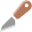
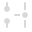

# 

 Knife Tool

The **Knife Tool** lets you draw a freehand or straight cutting line across any open curve or shape to split the object up into smaller fragments. A scissor-cut feature also lets you click on any open curve to break the curve at a chosen node or anywhere on a curve segment; a polycurve is created.

> **Tip:** Tool shortcut : `K`

### Settings

The following settings can be adjusted from the context toolbar:

- **Options**—various cutting options include:
   - 

     **Straight Line**—when enabled, a straight knife stroke can be drawn across your object from a fixed position.
  - 

     **Auto Close**—when enabled, the start and end nodes of the knife stroke are connected to form a closed shape that is cut out from the object.

  **Stabiliser**—enables stroke stabilisation using one of two modes:
   - 

     **Rope mode**—drags the stroke end by a 'rope' to smooth the stroke but lets you introduce sharp corners at increasing rope *Length* (radius) values by redirecting the slackened rope.
  - 

     **Window mode**—smoothes the stroke by averaging sampled input positions within a *Window* whose size is configurable.

#### SEE ALSO:

- [Cutting objects](../../08-object-control/08-cutting-objects.md)
