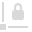

# 

 Fill Tool

The **Fill Tool** allows you to adjust the fill and line colours applied to vector and text objects.

Although you can use the Fill Tool to apply solid colours to an object's fill or stroke, its true power lies in its ability to apply and modify gradients.

> **Note:** You can also apply a gradient to pixel layers, adjustment layers and layer masks using the Fill Tool.

> **Note:** You can also apply bitmap fills to objects, allowing you to add a bitmap image from an external source (like a pattern or texture) which can then be transformed on the object.

### Settings

The following settings can be adjusted from the context toolbar:

- **Context**—allows the adjustment of either the **Fill** or **Stroke** colour of the selected object.
- **Type**—converts the object's colour type. For example, from **None** to **Linear**. From here, you can also apply a **Solid** or **Bitmap** fill.
- Select, pick, and modify the object's solid or gradient colour—click the colour swatch to display a pop-up panel. See the [Colour panel](../../23-panels/06-colour-panel.md), [Swatches panel](../../23-panels/18-swatches-panel.md), and [Gradient and bitmap fills](../../06-colour/12-gradient-and-bitmap-fills.md) topics for more information on the settings available.
- 

   **Rotate gradient**—rotates the applied gradient by 90°.
- 

   **Reverse gradient**—the end stops swap places. (All intermediate stops are also repositioned accordingly.)
- 

   **Maintain fill aspect ratio**—if this option is off (default), the end stops can be resized separately which changes aspect ratio. When selected, the end stops are locked to keep the aspect ratio (i.e. changing one will automatically update the other). This setting affects only elliptical and bitmap fills.
- **Extend**—for bitmap fills only, these settings control how to present the bitmap fill's tile:
   - **Wrap**—repeats the bitmap outwards from a centrally set node; when it is smaller than the shape it is filling, it is tiled over to fill it.
  - **Mirror**—repeats the bitmap outwards from a centrally set node; the option aids smooth transition and seamless presentation of the bitmap fill while resizing, however this can be easily moved by dragging to a new position.
  - **Repeat**—used to achieve symmetrical and seamless patterns, which can be stacked infinitely.
  - **Zero**—places the bitmap centrally without it repeating. This option is helpful for positioning the image within a shape or a frame, i.e. to establish its starting point, before deciding on a repeating Extend method.
- **Quality**—for bitmap fills only, these settings control the quality of the fill when scaling the object:
   - **Nearest**—the quickest method to use while picture scaling at a cost of some image quality loss, however improved speed. This variant does not employ pixel interpolation, and so results in a sharper yet more jagged image.
  - **Bilinear**—similar to **Nearest**, however using a sophisticated interpolation technique whilst filling in empty pixels. Here, rather than copying the nearest pixel, the process uses adjacent pixels and this results in a considerably smoother scaling.
  - **Lanczos3**—may be used to seamlessly interpolate the value of samples or as a low-pass filter, which should result in an even smoother transition of pixels. It is also approximately similar to the bicubic method of interpolation.
- **Scale with object**—for bitmap fills only, when checked, the bitmap fill will scale in proportion to its object being rescaled; when unchecked, you'll avoid any unwanted shrinking or stretching of your bitmap fill during object rescaling.

#### SEE ALSO:

- [Transparency Tool](12-transparency-tool.md)
- [Selecting colours](../../06-colour/06-selecting-colours.md)
- [Gradient and bitmap fills](../../06-colour/12-gradient-and-bitmap-fills.md)
- [Keyboard shortcuts for tools](../../26-keyboard-shortcuts/01-keyboard-shortcuts.md)
