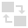

# 

 Vector Flood Fill Tool

The **Vector Flood Fill Tool** allows you to fill in areas of your design, creating new shapes with solid, gradient or bitmap fills. The tool is located on the Tools panel.

Once you've loaded a fill, the tool lets you flood areas formed from pre-selected overlapping shapes or curves. You can drag across multiple areas to flood fill or click on individual areas. You can also quickly recolour individual shapes whether selected or not.

For raster work (via **Pixel Persona**), an equivalent feature is available by using the **Flood Fill Tool**.

To find out more about the use of this tool, look at the [Flooding areas](../../08-object-control/19-flooding-areas.md) topic.

> **Tip:** Tool shortcut : `R`

### Settings

The following settings can be adjusted from the context toolbar:

- **Insertion mode**—controls where created shapes are placed in relation to original shapes.
   - 

     **Inside**—creates new shapes and places them inside existing shapes where possible.
  - 

     **In-between**—creates new shapes from areas formed by overlapping shapes and inserts them between the target shape and the shape above.
- **Fill mode**—three modes let you control how you flood with *semi-transparent* fills or bitmaps with alpha. Solid fills will always replace any current semi-transparent fill(s).
   - 

     **Add on top**—flood fills are added on top of the current fill, creating a stack that can be managed via the **Appearance** panel.
  - 

     **Smart refill**—like Add on Top, but the same fill can only be applied once to the stack; this is useful to avoid flooding with the same fill twice when dragging across areas. For example, the same 'alpha' bitmap texture can't be used multiple times.
  - 

     **Knockout**—the flood fill replaces the current fill.
- **Options**—filling options let you set how areas are filled:
   - 

     **Fill to Visible Boundaries**—when enabled, the fill extends to the outline of a shape or a curve's path, ignoring edges formed by overlapping. If the fill colour across areas is the same then flooding will extend to the whole area automatically. When disabled (default), the edges created by overlapping can be filled to as well as to the outline of a shape or a curve's path.
- **Fit mode**—only displays for applied bitmap (e.g., raster textures) or gradient fills. These can be scaled according to one of several behaviours:
   - **Max Fit**—the bitmap/gradient fill is automatically scaled to fill the entire area without distorting it. Some of its contents may be cropped.
  - **Min Fit**—the bitmap/gradient fill is automatically scaled to be completely visible within the area.
  - **Stretch**—the bitmap/gradient fill is automatically scaled to be completely visible and fill the entire area. It may be noticeably distorted, depending on the relative proportions of it and the area.
  - **None**—the bitmap/gradient fill is not scaled to fit the area.
- 

   **Set Bitmap Fill**—click to load an image as a bitmap fill from Files or Photos; tap to apply the fill to an area.

#### SEE ALSO:

- [Flooding areas](../../08-object-control/19-flooding-areas.md)
- [Flood Fill Tool](24-flood-fill-tool.md)
- [Keyboard shortcuts for tools](../../26-keyboard-shortcuts/01-keyboard-shortcuts.md)
