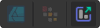

# 

 

 Slice Tool

The **Slice Tool** allows you to create and edit drawn export areas, called slices, so you can select portions of your design to be exported as individual graphics.

As an alternative to drawing slices using the tool, selected objects and layers can also be made into automatically-sized slices.

> **Note:** Available in Export Persona only.

### Settings

The following settings can be adjusted from the context toolbar:

- **Revert to auto sized**—resets the dimensions of a resized slice created from a layer back to its original size.

#### SEE ALSO:

- [Exporting using Export Persona](../../15-exporting/01-exporting-using-export-persona.md)
- [Export](../../14-saving-and-sharing/03-export.md)
- [Keyboard shortcuts for tools](../../26-keyboard-shortcuts/01-keyboard-shortcuts.md)
