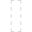

# 

 

 

 

 

 

 Marquee Selection Tools

The Marquee Selection Tools provide various ways of applying selections to your image.

The Marquee Selection Tools are available in various shapes including **Rectangular**, **Elliptical**, **Column**, and **Row**. All marquees are applied by simply selecting the desired shape and then dragging on your image.

A **Freehand Selection Tool** is also available for defining the selection area as a drawn pencil line, polygonal straight line edges, or snapped magnetic nodes.

### Settings

The settings for each tool vary but may include some or all of the following settings, which can be adjusted from the context toolbar:

- **Mode**—select from **New**, **Add**, **Subtract**, and **Intersect**.
- **Refine**—click to display the [Refine Selection](../../13-selections/05-refining-pixel-selection-edges.md) dialog to access advanced selection settings.
- **Feather**—reduces the sharpness of selection edges by partially selecting edge pixels.
- **From Centre**—when enabled, the selection will be drawn from its centre. This is exclusive to the Elliptical Marquee Tool.
- **Antialias**—if this option is off (default), pixels at the edge of the selection are opaque. When selected, selection edges are smoothed by applying transparency to edge pixels.
- **Width**—sets the width of the **Column** or **Row** selection tools.

### About selection modes

The four modes available from the context toolbar affect how your selection develops.

- **New**—cancels all current selections and creates a new selection.
- **Add**—adds areas to the current selection. If there is no selection in place, a new selection will be created.
- **Subtract**—removes areas from the current selection.
- **Intersect**—a new selection area is created from the overlap between the drawn shape and the current selection.

### Freehand selection types

The **Freehand Selection Tool** offers three distinct selection types:

- **Freehand**—creates a selection which follows the cursor's exact movements.
- **Polygonal**—creates a selection based on connected straight lines with a single click defining each change in direction.
- **Magnetic**—creates a selection by creating automatic nodes that snap to distinct edges while following the cursor's movement. Click to define custom node positions.

When drawing a Freehand selection, you can manually pan the document view by holding `Spacebar` and dragging, then release the `Spacebar` to continue drawing your selection. This also applies when Polygonal is selected and you drag to momentarily make a Freehand selection.

When drawing a Polygonal or Magnetic selection, the document view will automatically pan when the cursor approaches one of its edges. For Magnetic selections, if auto-panning causes unwanted nodes to be created, use the Undo command to remove them.

> **Note:** ### Modifier keys
>
>
> When using the Freehand Selection Tool, the following modifier keys can be used to aid in the creation of selections:
>
>
> - The `Shift`  temporarily switches to **Polygonal** if using **Freehand**.
> - The `Shift`  temporarily switches between **Polygonal** and **Magnetic**.
> - If using **Polygonal** and **Magnetic**, dragging will temporarily invoke **Freehand**.

> **Preferences:** ### Settings (or Preferences)
>
>
> Related behaviours can be adjusted from [the app's settings](../../27-settings-preferences/01-settings-preferences.md):
>
>
> - **Tools>Select object when intersects with selection marquee**

#### SEE ALSO:

- [Creating pixel selections](../../13-selections/01-creating-pixel-selections.md)
- [Refining pixel selection edges](../../13-selections/05-refining-pixel-selection-edges.md)
- [Selection Brush Tool](03-selection-brush-tool.md)
- [Keyboard shortcuts for tools](../../26-keyboard-shortcuts/01-keyboard-shortcuts.md)
