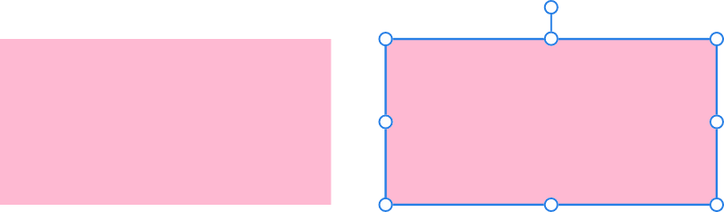
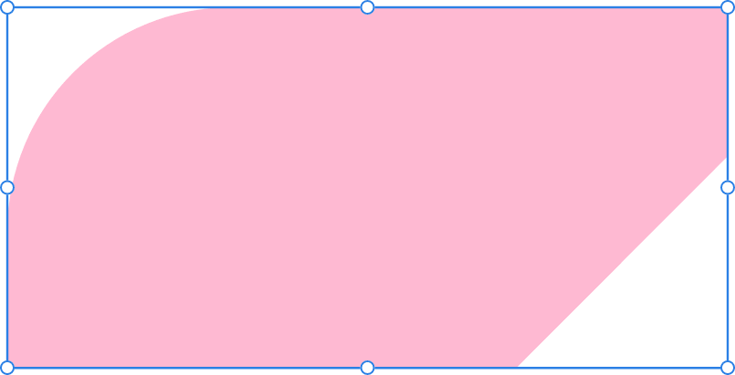
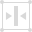

# 

 Rectangle Tool

Rectangles are commonly used when drawing and are arguably one of the most used shapes in artwork and design. The **Rectangle Tool** makes it extremely quick and easy to draw rectangles and squares.

*Default shape before customisation.*

## Customisation

The context toolbar's **Single radius** option can be used to allow one of several corner types to be applied selectively to any corner. Once applied, the displayed red handle can be dragged to control the corner radius.

*Two possible outcomes when the options are customised—selective rounded and mixed corner shapes.*

### Settings

The following settings can be adjusted from the context toolbar:

- **Fill**—click the colour swatch to display a pop-up panel to update fill colour.
- **Stroke**—click the colour swatch to display a pop-up panel to update stroke colour.
- **Stroke properties**—set the stroke style, width, joins, cap ends, order and arrowhead settings via a pop-up panel.
- 

   **Presets**—click to display a pop-up panel from which you may select an existing preset (if any are available) or create a new preset.
- **Single radius**—when selected (default), allows you to modify all four corners simultaneously by setting one radius. If this option is off, you can set each corner radius individually and change corner type.
- **Absolute sizes**—by default, the corner radius is specified as a percentage of the object and scales as the object is resized. When selected, this option allows you to specify the corner radius in units. If the object is resized, the corner radius remains the same instead of scaling with the object.
- **Corner**—sets the style and radius of the rectangle's corners. You can choose a Rounded (fillet), Straight (chamfer), Concave (scallop) or Cutout option. You can also alter the radius of your selected corner type by adjusting the percentage slider or manually entering a new percentage.
- 

   **Enable Transform Origin**—displays a movable transform origin about which the shape can be rotated.
- 

   **Hide Selection while Dragging**—when selected, the object's selection box is temporarily hidden when transforming the object. If this option is off, the selection box remains visible during transformation. The selected behaviour persists across all objects unless it is manually switched.
- 

   **Show Alignment Handles**—when selected, displays alignment handles at the centre and edges of the selected object. Hovering over these handles displays a floating guideline across the page. You can drag the handles to position the centre or edges of the selected object in line with this guide.
- 

   **Transform Objects Separately**—when selected, where multiple objects are selected, they can be be resized, rotated and sheared independently of each other instead of transforming the bounding box.
- 

   **Convert to Curves**—converts the selected object into a series of connected lines and nodes.
- **Select new object**—when enabled (default), the new shape layer will be selected on creation.

> **Note:** To reset any red handle to its default position, simply double-click the handle.

> **Preferences:** ### Settings (or Preferences)
>
>
> Related behaviours can be adjusted from [the app's settings](../../27-settings-preferences/01-settings-preferences.md):
>
>
> - **Tools>Tool Handle Size**

#### SEE ALSO:

- [Rounded Rectangle Tool](03-rounded-rectangle-tool.md)
- [About geometric shapes](../../05-drawing-curves-and-shapes/05-about-geometric-shapes.md)
- [Draw and edit shapes](../../05-drawing-curves-and-shapes/06-draw-and-edit-shapes.md)
- [Callout Rounded Rectangle Tool](18-callout-rounded-rectangle-tool.md)
- [Keyboard shortcuts for tools](../../26-keyboard-shortcuts/01-keyboard-shortcuts.md)
