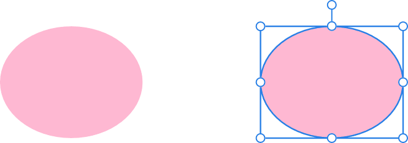

# 

 Ellipse Tool

An ellipse is a useful object and one that is virtually impossible to create freehand. The **Ellipse Tool** takes the hassle out of creating circles and ellipses.

### Settings

The following settings can be adjusted from the context toolbar:

- **Fill**—click the colour swatch to display a pop-up panel to update fill colour.
- **Stroke**—click the colour swatch to display a pop-up panel to update stroke colour.
- **Stroke properties**—set the stroke style, width, joins, cap ends, order and arrowhead settings via a pop-up panel.
- 

   **Presets**—click to display a pop-up panel from which you may select an existing preset (if any are available) or create a new preset.
- **Convert to Donut**—Swaps the ellipse for a donut shape.
- **Convert to Pie**—Swaps the ellipse for a pie shape.
- 

   **Enable Transform Origin**—displays a movable transform origin about which the shape can be rotated.
- 

   **Hide Selection while Dragging**—when selected, the object's selection box is temporarily hidden when transforming the object. If this option is off, the selection box remains visible during transformation. The selected behaviour persists across all objects unless it is manually switched.
- 

   **Show Alignment Handles**—when selected, displays alignment handles at the centre and edges of the selected object. Hovering over these handles displays a floating guideline across the page. You can drag the handles to position the centre or edges of the selected object in line with this guide.
- 

   **Transform Objects Separately**—when selected, where multiple objects are selected, they can be be resized, rotated and sheared independently of each other instead of transforming the bounding box.
- 

   **Convert to Curves**—converts the selected object into a series of connected lines and nodes.
- **Select new object**—when enabled (default), the new shape layer will be selected on creation.

> **Tip:** Tool shortcut : `M`. This also cycles through to select the **Rectangle** and **Rounded Rectangle** Tools.

> **Note:** To reset any red handle to its default position, simply double-click the handle.

> **Preferences:** ### Settings (or Preferences)
>
>
> Related behaviours can be adjusted from [the app's settings](../../27-settings-preferences/01-settings-preferences.md):
>
>
> - **Tools>Tool Handle Size**

#### SEE ALSO:

- [About geometric shapes](../../05-drawing-curves-and-shapes/05-about-geometric-shapes.md)
- [Draw and edit shapes](../../05-drawing-curves-and-shapes/06-draw-and-edit-shapes.md)
- [Crescent Tool](15-crescent-tool.md)
- [Donut Tool](12-donut-tool.md)
- [Pie Tool](13-pie-tool.md)
- [Segment Tool](14-segment-tool.md)
- [Callout Ellipse Tool](19-callout-ellipse-tool.md)
- [Keyboard shortcuts for tools](../../26-keyboard-shortcuts/01-keyboard-shortcuts.md)
