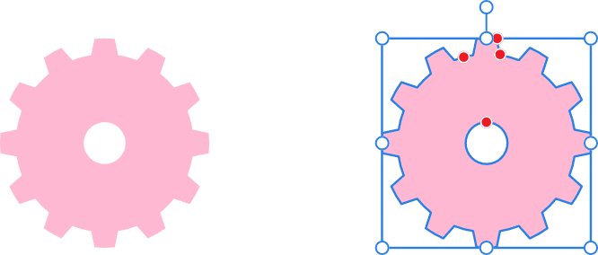
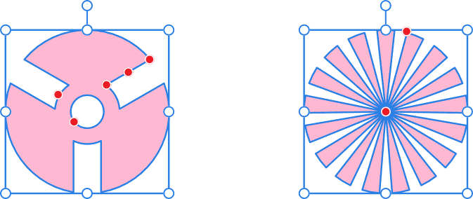

# 

 Cog Tool

The **Cog Tool** is possibly one of the most versatile shape tools in the shape toolset. It's geometrically accurate and has a wide range of customisable control points to allow you to create a wide range of useful shapes, from cogs to sunbursts!

*Default shape and handle position (in red) before customisation.*

## Customisation

The **Cog Tool** has several options on the shape and on the context toolbar to enable the number of teeth, tooth and notch size, and inner radius and hole size to be controlled.

*Two possible outcomes when the options are customised.*

### Settings

The following settings can be adjusted from the context toolbar:

- **Fill**—click the colour swatch to display a pop-up panel to update fill colour.
- **Stroke**—click the colour swatch to display a pop-up panel to update stroke colour.
- **Stroke properties**—set the stroke style, width, joins, cap ends, order and arrowhead settings via a pop-up panel.
- 

   **Presets**—click to display a pop-up panel from which you may select an existing preset (if any are available) or create a new preset.
- **Teeth**—sets the number of protrusions on the shape.
- **Inner radius**—controls the width of cog's teeth relative to the width of the shape.
- **Hole radius**—controls the width of the hole at the shape's centre.
- **Tooth size**—controls the width of the upper end of the cog's teeth.
- **Notch size**—controls the width of the lower end of the cog's teeth.
- **Curvature**—adds a curved edge to cog teeth.
- 

   **Enable Transform Origin**—displays a movable transform origin about which the shape can be rotated.
- 

   **Hide Selection while Dragging**—when selected, the object's selection box is temporarily hidden when transforming the object. If this option is off, the selection box remains visible during transformation. The selected behaviour persists across all objects unless it is manually switched.
- 

   **Show Alignment Handles**—when selected, displays alignment handles at the centre and edges of the selected object. Hovering over these handles displays a floating guideline across the page. You can drag the handles to position the centre or edges of the selected object in line with this guide.
- 

   **Transform Objects Separately**—when selected, where multiple objects are selected, they can be be resized, rotated and sheared independently of each other instead of transforming the bounding box.
- 

   **Convert to Curves**—converts the selected object into a series of connected lines and nodes.
- **Select new object**—when enabled (default), the new shape layer will be selected on creation.

> **Note:** To reset any red handle to its default position, simply double-click the handle.

> **Preferences:** ### Settings (or Preferences)
>
>
> Related behaviours can be adjusted from [the app's settings](../../27-settings-preferences/01-settings-preferences.md):
>
>
> - **Tools>Tool Handle Size**

#### SEE ALSO:

- [About geometric shapes](../../05-drawing-curves-and-shapes/05-about-geometric-shapes.md)
- [Draw and edit shapes](../../05-drawing-curves-and-shapes/06-draw-and-edit-shapes.md)
