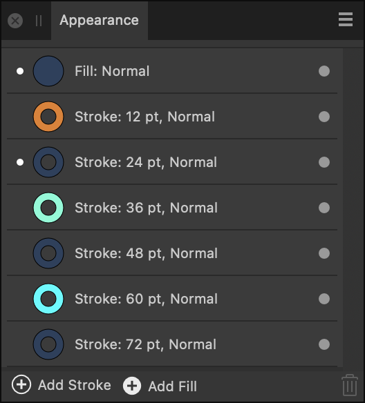

# Appearance panel

The **Appearance** panel allows you to apply multiple strokes and/or fills to any selected object. With drag-and-drop ordering and control of stroke widths and per stroke/fill blending, you can achieve striking creative effects.

*The Appearance panel.*

From the **Appearance** panel you can:

- Manage strokes and fills for the selected object
- Apply additional strokes and fills to the selected object
- Hide or show strokes and fills
- Set the active stroke and fill which can then be edited via the **Stroke** and **Colour** panels
- Apply independent blending control of strokes or fills instead of for the object
- Delete strokes and fills

The panel displays the following:

- **Stroke**—the stroke entry showing the stroke colour, width and blend mode. The active stroke will be denoted by a white dot to the left of its entry. This is the stroke that will be affected by **Stroke** panel editing.
- **Fill**—the fill entry showing the fill colour and blend mode. The active fill will be denoted by a white dot to the left of its entry. This is the fill that will be affected by **Colour** panel editing.
- **Add Stroke**—creates a new active stroke above the current active stroke.
- **Add Fill**—creates a new active fill above the current active fill.
- **Remove**—deletes the currently selected stroke or fill.

#### SEE ALSO:

- [Using multiple strokes and fills](../05-drawing-curves-and-shapes/09-using-multiple-strokes-and-fills.md)
- [Stroke panel](16-stroke-panel.md)
- [Colour panel](06-colour-panel.md)
- [Customising the workspace](../21-workspace/customise/02-workspace.md)
