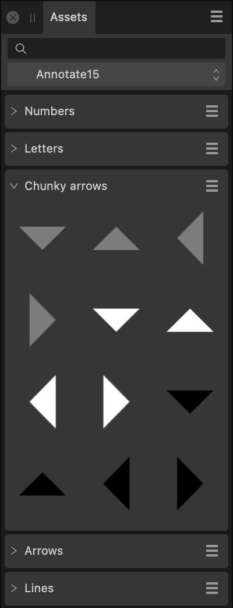

# Assets panel

The **Assets** panel acts as an area for storing design elements which you can then access from any Affinity Designer document.

The **Assets** panel is hidden by default. It can be switched on via the **Window** menu when working in Designer or Pixel Persona.

> **Tip:** Assets are listed in the Assets panel in the order in which they were added. However, you can manually reorder assets in the panel by dragging them while holding down the `Alt` .

*The Assets panel.*

## Importing and exporting assets

Assets can be exported to and imported from external files (add-ons) via the Panel Preferences menu. For more information on add-ons, see the [About add-ons](../16-add-ons/01-about-add-ons.md) topic.

### Options

The following options are available in the panel:

- Category—displays the currently active category. Select from the pop-up menu.
- Subcategory—displays all assets in that subcategory. Click a subcategory's title to collapse or expand the subcategory.
- Search—allows you to narrow down the assets in the panel to those with names which conform to the search criteria. Type directly in the text box.

 The following options are available from panel preferences:

- **Create New Category**—adds a new, custom assets category to the panel.
- **Rename Category**—allows you to rename the currently selected category.
- **Duplicate Category**—adds a second copy of the currently selected category to the panel. The new copy is not automatically linked to your other Affinity apps.
- **Link Category**—makes the currently selected category available in all your Affinity 2 apps.
- **Delete Category**—removes the currently selected category (and all its assets) from the panel.
- **Sort Categories By**—allows you to sort assets categories by **Name** or **Date Added**.
- **Create Subcategory**—adds a new subcategory to the currently selected category.
- **[Import Assets](../16-add-ons/04-importing-add-ons.md)**—allows you to add an .afassets file and adds a new category to the panel pre-populated with subcategories and assets from your imported file.
- **[Export Assets](../16-add-ons/03-exporting-add-ons.md)**—creates an *.afassets file containing the assets and subcategory structure from the currently selected category.
- **Expand All**—opens all subcategories in one operation.
- **Collapse All**—closes all subcategories in one operation..
- **Embed in current document**—embeds the assets in your Assets panel into your current document so that they can be accessed when opening the document later on a different computer (or on the same computer if assets were deleted). On opening a document with embedded assets, you're prompted if you want to import assets to your Assets Panel, making them available to all documents.
- **Show As List**—if this option is off (default), assets are displayed as thumbnails in a grid with tooltips displaying their name. When selected, assets are displayed as named thumbnails in a list.

 The following options are available from subcategory option menus:

- **Rename**—allows you to rename the subcategory.
- **Delete**—removes the subcategory (and all its assets) from the panel.
- **Move Up**—repositions the subcategory above the previous subcategory so it is listed higher in the panel. If this option is greyed out, the subcategory is at the top of the panel.
- **Move Down**—repositions the subcategory below the next subcategory so it is listed lower in the panel. If this option is greyed out, the subcategory is at the bottom of the panel.
- **Sort By Name**—allows you to sort assets in the current subcategory by name. You can drag-and-drop individual assets within or across subcategories to move and reorder them.
- **Add from Selection**—adds all the objects in the current on-page selection to the subcategory as assets. Grouped objects are added as a single asset.

> **Note:** It is also possible to reorder subcategories by dragging their entries up or down inside the category group.

#### SEE ALSO:

- [Using assets](../08-object-control/24-using-assets.md)
- [Symbols panel](19-symbols-panel.md)
- [Customising the workspace](../21-workspace/customise/02-workspace.md)
- [About add-ons](../16-add-ons/01-about-add-ons.md)
