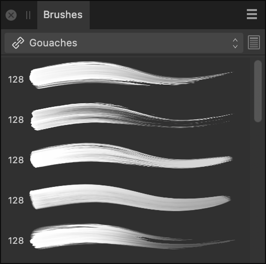

# Brushes panel

The **Brushes** panel hosts a selection of brush presets which can be selected for use with the Vector Brush Tool and Paint Brush Tool (Designer Persona and Pixel Persona, respectively). Any custom brushes you design can be saved to your own panel categories. ABR Brush files can be imported and will be available in their own separate categories.

## About the Brushes panel

A choice of pre-designed brushes is available as selectable thumbnails. With the brush tool selected, the selected thumbnail sets the type of brush to be used. Brushes are arranged in categories.

*The Brushes panel in Pixel Persona.*

> **Note:** Designer Persona offers only vector brushes via the Vector Brush Tool; Pixel Persona offers pixel-based brushes via the Paint Brush Tool exclusively.

## Importing and exporting brushes

Brushes can be exported to and imported from external files (add-ons) via the Panel Preferences menu. For more information on add-ons, see the [About add-ons](../16-add-ons/01-about-add-ons.md) topic.

### Options

The following options are available on the panel:

- Category pop-up menu. To display brush thumbnails for the chosen category.
- 

   Edit Brush—loads the selected brush in the **Editing** dialog, allowing it to be customised and saved as a new brush preset.
- Brush thumbnails for the current category.

The following options are available from the 

 Panel Preferences menu:

- **Create New Category**—adds a new, empty category to the pop-up menu.
- **Rename Category**—allows you to rename the currently selected brush category.
- **Duplicate Category**—adds a second copy of the currently selected category to the panel. The new copy is not automatically linked to your other Affinity apps.
- **Link Category**—makes the currently selected category available in all your Affinity 2 apps.
- **Delete Category**—removes the selected category.
- **Sort Categories By**—allows you to sort brush categories by **Name** or **Date Added**.
- **Show as List**—by default, brushes are shown in lists; uncheck to present brushes as nozzle thumbnails in a grid.
- **Show Brush Names**—when selected, brush names will be displayed under each brush.
- **Auto-scroll**—when enabled, the last used brush will be automatically scrolled to and displayed when you return to the brush tool from other tools. When disabled, auto-scrolling does not occur.
- **Auto-switch category**—when enabled, the option automatically switches to the brush category containing the last used brush when you return to the brush tool from other tools. When disabled, auto-switching does not occur.
- **Enable Associated Tools**—when enabled, the setting will associate the tool set with the brush you are modifying. When disabled, the setting disables the switching for brushes that already have associated tools assigned to them. This option is for raster brushes in Pixel Persona only.
- **[Import Brushes](../16-add-ons/04-importing-add-ons.md)**—allows you to import a set of vector or pixel brushes, including those in ABR format. Imported vector brushes will be available in a new Brushes panel category in Designer Persona; imported pixel brushes will be available via Pixel Persona in the equivalent location.
- **[Export Brushes](../16-add-ons/03-exporting-add-ons.md)**—allows you to export the currently selected brush category, ready for sharing with other users.

For vector brushes:

- **New Solid Brush**—creates a basic, solid vector stroke.
- **New Textured Intensity Brush**—creates a brush stroke based on the opacity values of a raster image. In the pop-up dialog, navigate to and select a file, and click **Open**.
- **New Textured Image Brush**—creates a brush stroke based on the colour values of a raster image. In the pop-up dialog, navigate to and select a file, and click **Open**.

For more information on creating custom brushes, see [Creating custom brushes](../10-vector-painting/03-creating-custom-vector-brushes.md).

For pixel brushes:

- **New Intensity Brush**—creates a brush stroke based on the opacity values of a raster image. In the pop-up dialog, navigate to and select a file, and click **Open**.
- **New Round Brush**—creates a brush stroke with a circular edge.
- **New Square Brush**—creates a brush stroke with a square edge.
- **New Image Brush**—creates a brush stroke based on an image. In the pop-up dialog, navigate to and select a file, and click **Open**.
- **New Brush From Selection**—creates a custom image brush from any pixel selection or an intensity brush from a mask.

Additionally, the following are available via `Click`-click on a brush:

- **Update**—saves new settings modified via the context toolbar with the brush.
- **Reset Brush**—returns to the brush default settings.
- **Rename Brush**—opens a dialog where a brush can be renamed.
- **Duplicate Brush**—copies the selected brush and places it directly underneath the selected brush.
- **Delete Brush**—removes the brush from the panel.
- **Move Brush to Category**—opens a dialog with a list of brush categories where a brush can be moved into.

For more information on creating custom brushes, see [Creating custom pixel brushes](../11-pixel-painting/04-creating-custom-pixel-brushes.md).

> **Note:** Switching to the Pixel Persona offers pixel brushes (e.g., spray) instead of vector brushes.

> **Preferences:** ### Settings
>
>
> Related behaviours can be adjusted from [the app's settings](../27-settings-preferences/01-settings-preferences.md):
>
>
> - **Miscellaneous>Reset Fills**
> - **Miscellaneous>Reset Brushes**
> - **User Interface>Show brush previews**
> - **User Interface>Always show brush crosshair**

#### SEE ALSO:

- [Painting brush strokes](../10-vector-painting/01-painting-vector-brush-strokes.md)
- [Painting pixel brush strokes](../11-pixel-painting/01-painting-pixel-brush-strokes.md)
- [Creating custom brushes](../10-vector-painting/03-creating-custom-vector-brushes.md)
- [Vector Brush Tool](../22-tools/design-tools/09-vector-brush-tool.md)
- [Paint Brush Tool](../22-tools/design-tools/21-paint-brush-tool.md)
- [About Personas](../01-introduction/03-personas.md)
- [Customising the workspace](../21-workspace/customise/02-workspace.md)
- [About add-ons](../16-add-ons/01-about-add-ons.md)
