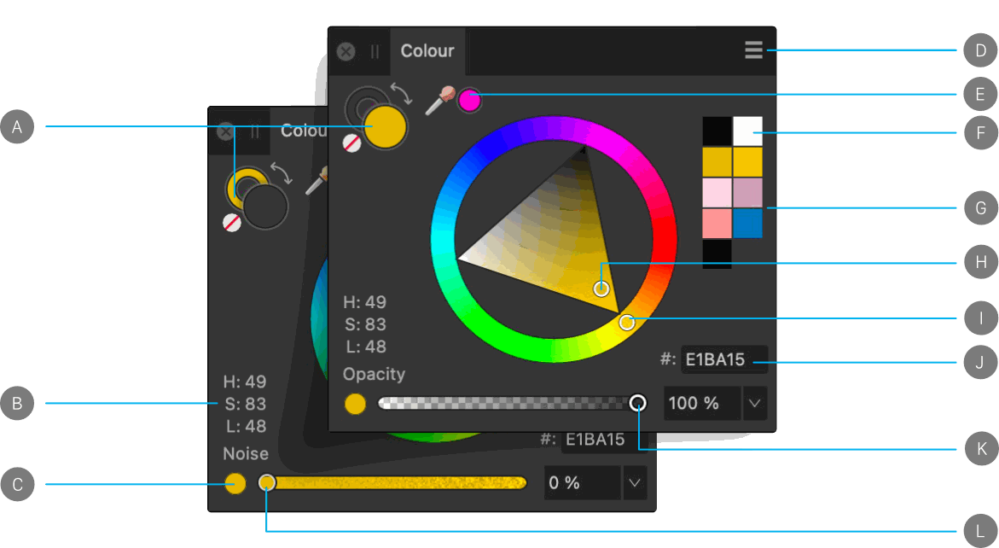

# Colour panel

The **Colour** panel is used to choose colour for various tools and selected objects.

> **Note:** A pop-up version of the **Colour** panel may appear when choosing colour from within other dialogs.

## About the Colour panel

The **Colour** panel can operate in several colour modes—HSL, RGB, CMYK and LAB—and has various ways of defining colour—colour wheel (HSL only), colour boxes and colour sliders. Colour tints can also be applied from within the panel.

*Colour panel (HSL colour wheel): (A) Primary/Secondary (left) or Stroke/Fill colour selectors with colour 'none' swatch and 'swap' arrow, (B) HSL values, (C) Switch to opacity/noise, (D) Panel Preferences, (E) Colour picker and picked colour swatch, (F) Black and white colour swatches, (G) Recent colours swatches, (H) Saturation/Lightness control, (I) Hue control, (J) RGB Hex value, (K) Opacity controls, (L) Noise controls.*

Like the **Swatches** panel, the **Colour** panel takes on different appearances depending on the active Persona and on the selected tool. The large colour selectors indicate the currently selected colours.

- In Designer Persona, objects have fill and stroke colour properties. The stroke colour is represented by the cutout (donut) colour selector. The fill is represented by the solid colour selector.
- In Pixel Persona, the two solid colour selectors indicate interchangeable Primary and Secondary colours.

The active colour selector is shown at the front of the two colour selectors. Choosing a new colour will apply it to the active colour selector.

> **Note:** These swatches change appearance for some vector tools.
>
>
> - 
>
>    **Fill Tool**: Only one colour selector swatch is shown to represent the colour of the currently selected stop on the gradient.
> - 
>
>    **Vector Brush Tool**: When selected, the panel shows primary and secondary swatches that can be swapped by clicking the adjacent double arrow.

## Using the Colour panel

With the **Colour** panel, colours can be applied to an object or for use by a tool in just a few clicks. Opacity and noise are further colour attributes which can be applied.

**To set the colour of a selector:**

1. Click the selector you want to apply the colour to. It will show at the front of the two colour selectors.
2. Do one of the following:
   - Choose a colour from the colour model's **Wheel** (HSL only), **Sliders**, or **Boxes**.
  - Click the picked colour swatch.
  - Click the **None** swatch to make the colour completely transparent (for the tool, fill or stroke).

> **Tip:** You can set the primary (fill) and secondary (stroke) colour selectors to white and black, respectively, by pressing the **D** . This affects any vector objects that are selected.

**To switch colours between the selectors:**

- Click the double-headed arrow. The colours switch (but the active swatch selector remains the same).

**To adjust opacity or noise setting:**

1. Select the toggle button to the bottom-left of the panel.
2. Drag the slider to set the value.

## Colour selection preferences and colour models

 When choosing colours in the **Colour** panel, you can choose from various selection preferences and colour model values. The colour selection preferences are changed in the Panel Preferences menu.

Depending on the colour model selected, you can also choose to work in **8 bit**, **16 bit** or **Percentage** mode.

Some of the selection methods allow you to set colour using values other than RGB. This doesn't change the working colour profile of the document, but changes the input values for the colours.

> **Note:** You can specify colour values for RGB, RGB Hex, HSL, CMYK and Greyscale depending on the pop-up menu in the **Colour** panel. This is not the same as the working colour profile. For example, if your working profile is an RGB profile, choosing 100% K (black) from the CMYK colour model doesn't convert your document to CMYK. Instead the colour applied will be an RGB approximation of 100% K (black). However, if you convert or export the document to a CMYK profile, the 100% K (black) will be honoured.

 The following colour selection preferences are available from the Panel Preferences menu.

- **Wheel**—HSL Colour Wheel
   - Drag on the outer ring to set the hue, and drag in the triangle to set saturation and lightness.
  - Click a swatch to the right of the wheel to select a recently used colour.
  - Enter an RGB Hex value into the **#** setting.
- **Sliders**—RGB, HSL, CMYK, LAB, Greyscale
   1. Select the colour mode from the pop-up menu.
  2. (Optional) From the Panel Preferences menu, select **8 bit**, **16 bit** or **Percentage**.
  3. Drag sliders or type directly into the value boxes to set the colour values.
- **Boxes**—Hue, Saturation, Lightness only
   - **Hue**—Drag on the hue slider to set the hue, drag in the box to set the saturation and lightness.
  - **Saturation**—Drag on the saturation slider to set the saturation, drag in the box to set the hue and lightness.
  - **Lightness**—Drag on the lightness slider to set the lightness, drag in the box to set the saturation and hue.
- **Tint**
  - Drag the slider to control the colour tint. The further to the left the slider is positioned, the less ink is applied to the page.

The HSL colour wheel's Saturation/Lightness control can be changed from **Triangle** to **Square** via the Panel Preferences menu.

 By default, the colour space is locked when using **Sliders** (e.g., CMYK sliders) to prevent it from changing. This avoids inadvertently swapping to another mode after using swatches or selecting a different object created with a different colour mode. When unlocked, the **Colour** panel will remember the colour mode that the selected object was created in. This lock only works on the current session; subsequent sessions will use the HSL colour wheel as default.

> **Tip:** `Shift`-dragging a **Colour** panel slider will move all of the sliders at once. This can be useful when you have a colour you like and you want to use a lighter or darker shade of it.

## Using the Colour Picker

The picker lets you sample colours within or outside Affinity Designer, then use them in your design.

**

 To use the Colour Picker:**

1. Drag the **Colour Picker** icon to the colour want to sample.
2. Click the selector you want to apply the colour to.
3. Click the swatch next to the **Colour Picker** to apply the colour.

## Saving chosen colours for later use

Once your colour has been chosen and applied to a tool or object, there are several ways to preserve this colour for later use.

 The following options are available from the Panel Preferences menu.

- **Copy Colour to Clipboard as Hex**—this calculates the current colour's Hex value and adds it to the clipboard. This is useful for web developers, to standardise on colours between graphics and HTML coding in a web environment.
- **Add Colour to Swatch**—adds the current colour to the currently loaded palette in the Swatches panel.
- **Add Chord to Swatch** pop-up menu—adds a chord of the current colour to the currently loaded palette in the Swatches panel.

#### SEE ALSO:

- [Selecting colours](../06-colour/06-selecting-colours.md)
- [Sampling colours](../06-colour/07-sampling-colours.md)
- [Colour Chords](../06-colour/11-colour-chords.md)
- [Customising the workspace](../21-workspace/customise/02-workspace.md)
