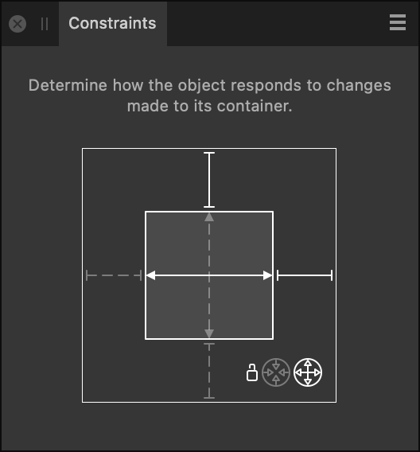

# Constraints panel

The **Constraints** panel lets you control how objects are positioned and scaled when presented on different artboards and differently sized layouts.

## About the Constraints panel

Constraints are useful when designing for different devices simultaneously—they are labour saving and preserve accuracy. Objects are selectively responsive to resizing and transforms.

The **Constraints** panel lets you prevent child objects from being scaled when its parent object is resized. Anchoring the child object to its parent is also possible. Both scaling and anchoring can be applied to top, bottom, right or left of the child object.

The Constraints panel is hidden by default. It can be switched on via the **Window** menu when working in Designer or Pixel Persona.

*The Constraints panel with top and right anchoring applied, horizontal scaling activated, vertical scaling deactivated, and Max Fit applied.*

The outer box represents the container (parent object). The inner box represents the nested content (child object).

### Options

The following options are available in the panel:

- Anchor lines—when grey and broken (default), the child object is not anchored in the selected direction. When white and solid, the child object is anchored in the selected direction.
- Scaling arrows—when white and solid (default), the child object will scale in the selected direction. When grey and broken, the child object will not scale in the selected direction. If white and broken, the child object is forced to scale in the selected direction due to anchoring applied on opposite sides.
- 

   Min Fit—when the parent object is resized disproportionately, the child object may scale so it always fits within its parent object (if unanchored).
- 

   Max Fit—when the parent object is resized disproportionately, the child object may scale but it will be allowed to be bigger than its scaled parent object, potentially clipping content from view.

#### SEE ALSO:

- [Constraints](../17-design-aids/15-constraints.md)
- [Customising the workspace](../21-workspace/customise/02-workspace.md)
