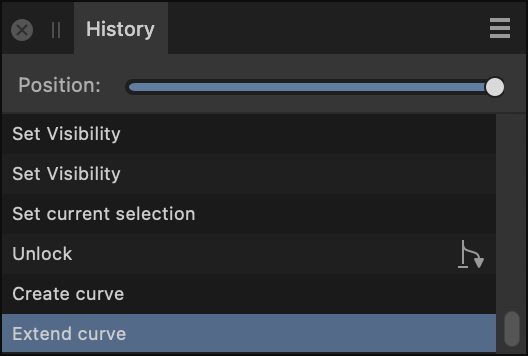

# History panel

The **History** panel tracks changes and shows each state as a labeled entry in a list. This allows you to return to earlier points in time quickly and easily.

## About the History panel

The **History** panel shows changes that are applied. The oldest state is the topmost in the list. When edits are made, new states are added to the bottom of the list.

> **Tip:** A document's [history can be saved](../17-design-aids/01-using-undo-redo-and-history.md) along with the document, so earlier edits can be returned to even if the document is closed and reopened.

*The History panel showing the actions that have been carried out on the file.*

If you click on an earlier state and then make a change, the new timeline you have created will be listed in the place of the original set of changes you made beyond that point. You can cycle between timelines by clicking on the Cycle future icon.

> **Note:** Unless you choose to save the document's history with the document, the undo states listed in the **History** panel are cleared when the document is closed.

### Options

The following options are available in the panel:

- **Position**—points on the slider represent edits made to a document from root (creation or opening) on the left to the latest edit on the right. Drag the slider left to undo a change, right to redo a change.
- State—gives a brief description of the edit made to the document. Click a state to jump back/forward to that edit.
- 

   **Cycle future**—appears where the history was changed, storing all of the original edits associated with that 'branch' of the timeline. If you want to revert to an old redo history after making a change, click the **Cycle future** icon beside the point in the timeline you wish to revert to in order to go back to your preferred redo history. You can click this again to toggle between the different series of edits you made beyond this point.

#### SEE ALSO:

- [Using undo, redo and history](../17-design-aids/01-using-undo-redo-and-history.md)
- [Using snapshots](../17-design-aids/16-using-snapshots.md)
- [Customising the workspace](../21-workspace/customise/02-workspace.md)
