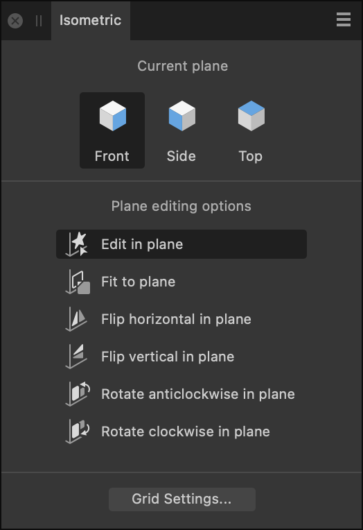

# Isometric panel

The **Isometric** panel lets you create an isometric grid on which you can draw objects in-plane, make '2D' objects fit to plane and transform planar objects between planes.

## About the Isometric panel

From the **Isometric** panel, you can draw and edit objects across three planes on an isometric grid. The panel also provides several transformation operations which can be applied to selected objects (shapes, text or images).

The Isometric panel is hidden by default. It can be switched on via the **Window** menu when working in Designer or Pixel Persona.

> **Tip:** If you haven't set up a grid previously, you'll be prompted to initially modify the settings (e.g., grid Spacing) for your new isometric grid; you can then make the grid visible.
>
>
> If an isometric or other type of axonometric grid was already set up, the you won't be prompted for settings.

*The Isometric panel.*

### Options

The following options are available in the panel:

**Current plane**

- 

   **Front**—when selected, all **Plane editing** options will be applied to the front plane.
- 

   **Side**—when selected, all **Plane editing** options will be applied to the side plane.
- 

   **Top**—when selected, all **Plane editing** options will be applied to the top plane.

> **Tip:** Press the apostrophe (') key to toggle between planes as you edit.

**Plane editing options**

- 

   **Edit in plane**—when selected, any object created is automatically fitted to the currently active plane.
- 

   **Fit to plane**—fits either a selected two-dimensional object or object on another plane to the currently active plane.
- 

   **Flip horizontal in plane**—flips the selected object horizontally within the currently active plane.
- 

   **Flip vertical in plane**—flips the selected object vertically within the currently active plane.
- 

   **Rotate anticlockwise in plane**—rotates the selected object 90 degrees anticlockwise within the currently active plane.
- 

   **Rotate clockwise in plane**—rotates the selected object 90 degrees clockwise within the currently active plane.

#### SEE ALSO:

- [Grids](../17-design-aids/04-grids.md)
- [Isometric and axonometric grids](../17-design-aids/05-isometric-and-axonometric-grids.md)
- [Customising the workspace](../21-workspace/customise/02-workspace.md)
