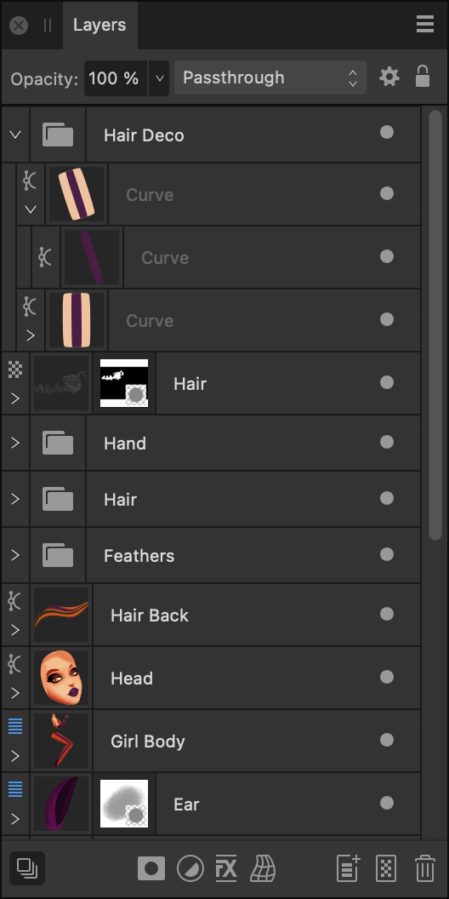
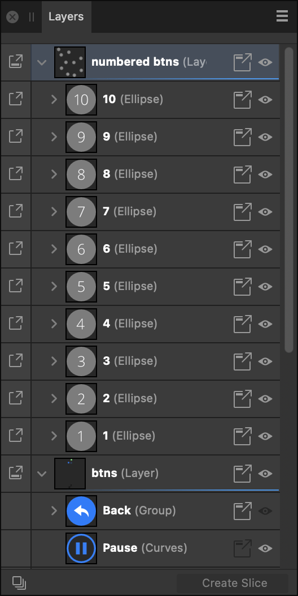

# Layers panel

The **Layers** panel lets you create a tiered document that can be designed more easily by management of layers.

## About the Layers panel in Designer/Pixel Persona

Layers are composited together to form your complete design which shows up on your page.

The panel can be used to build up your design as multiple layers, with each layer devoted to a particular facet (e.g., lines, shapes, text, adjustments, etc.).

> **Note:** [Artboards](../04-artboards/01-about-artboards.md) are also located on the Layers panel and can be organised in the same way as layers.

From the **Layers** panel you can:

- Create or delete layers and groups
- Select, reorder, show/hide and lock (artboards, layers, groups and objects)
- Clip layers, groups and objects
- Apply layer and artboard opacity
- Apply blend modes and blend ranges
- Create masks
- Add layer adjustments and effects

Layer management features let you optimise layer control, e.g.

- Reselect pixel brushes previously applied to a layer
- Collapse/expand specific or all layers and groups
- Tag layers with a choice of colours
- Change the UI display colour of all object's path, nodes and handles
- Exclude object from being a snapping candidate (`Click`-click object only)
- Switch off Auto-scroll (panel scrolls to layer content when it is selected on the page)
- Display layer thumbnails with a solid or checkerboard background
- Determine the size of layer thumbnails

## About the Layers panel in Export Persona

The Layers panel in Export Persona looks similar to that in Designer/Pixel Persona. The key difference is that it is not intended to help edit items on the page but instead to select layers to create exportable slices from.

*The Layers panel in Designer/Pixel Persona (left) and Export Persona (right).*

The panel displays the following:

- 

   Panel Preferences menu which offers:
   - **Auto-scroll**—when selected (default), the selected object's layer entry immediately comes into view in the **Layers** panel.
  - **Show Group Thumbnails**—when selected (default), each group layer’s thumbnail displays a preview of all the group’s contents. When deselected, a folder icon is shown instead.
  - **Show Object Type**—when selected (default), each layer entry displays an icon to identify its type. When deselected, icons are hidden.
  - **Thumbnail Background**—when selected, layer thumbnail backgrounds will display a checkerboard which can be darkened/lightened, or display automatically (default) according to **UI Style** (Settings (or Preferences)>User Interface).
  - **Small Thumbnails**—when selected (default), displays small thumbnails.
  - **Medium Thumbnails**—when selected, displays medium thumbnails.
  - **Large Thumbnails**—when selected, displays large thumbnails.
  - **Close**—hides the current panel.
  - **Close Panel Group**—hides the current panel and other panels in the panel group.
- **Opacity**—Adjusts opacity of the selected item(s).
- Blend Mode—Changes how the applied pixels interact with existing pixels on the layer below. Choose mode type from a pop-up menu.
- 

   **Blend Options**—Click to access a dialog for setting the blend ranges, blend gamma and antialiasing settings for the selected layer.
- 

   **Lock/Unlock**—Click to lock or unlock selected items to prevent accidental selection and transformation.
- Layer entry—The layer for the created item, comprised of:
   - 

     **Expand/Collapse**—Click to expand/contract the item, revealing nested content. `Click`-click options let you affect a currently expanded parent layer(s) and group(s) using **Expand Selection**/**Collapse Selection** or affect all parents in the layer stack using **Collapse All Parents** (or **Layer > Collapse All in Layers Panel**). Alternatively, it is possible to expand or collapse layers in a stack or group by pressing the `Alt`  whilst clicking on the Expand/Collapse chevron.
  - 

     **Expand/Collapse**—Click to expand/contract the item, revealing nested content. `Click`-click options let you affect a currently expanded parent layer(s) and group(s) using **Expand Selection**/**Collapse Selection** or affect all parents in the layer stack using **Collapse All Parents** (or **Layer > Collapse All in Layers Panel**). Alternatively, it is possible to expand or collapse layers in a stack or group by pressing the `Alt`  whilst clicking on the Expand/Collapse chevron.
  - Layer type—The [layer's type](../07-layers/01-about-layers.md), identified by a unique symbol.
  - Layer thumbnail—Visual representation of the layer contents on a checkerboard transparent background.
  - Layer name/type description—Text description of the layer type if unnamed; a double-click will let you name the item (removing the layer type description). For text layers, the text used on the page will be shown, while placed documents will show their filenames.
  - 

     **Recent brushes**—For pixel layers with pixel brush strokes already applied, clicking the icon offers the previously used brushes on that layer for reselection and further painting. For the current session only.
  - 

     **Toggle Visibility**—Disable to hide the item; enable to make it visible again. `Click`-click to hide selected layers (**Hide**), hide all other unselected layers (**Hide Others**), show other hidden layers (**Show Others**) or colour tag the layer for easy layer identification.
- 

   **Edit All Layers**—Allows selection and editing of objects across all artboards and layers (rather than the current layer).
- 

   **Mask Layer**—Creates a layer mask to reveal a portion of a layer while the rest of the layer remains hidden.
- 

   **Adjustments**—Adds a non-destructive adjustment layer to the current layer for tonal and colour correction. Each [adjustment type](../19-adjustments/01-applying-adjustments.md) has its own symbol to uniquely identify it from other adjustment types.
- 

   **Layer Effects**—Applies a layer effect to the currently selected layer.
- 

   **Warp**—applies a warp to the currently selected objects. A non-destructive warp group is created.
- 

   **Add Layer**—Creates an empty new layer above the currently selected layer.
- 

   **Add Pixel Layer**—Creates an empty new pixel layer above the currently selected layer.
- 

   **Remove Layer**—Deletes the currently selected layer or artboard.

#### SEE ALSO:

- [About layers](../07-layers/01-about-layers.md)
- [Create layers](../07-layers/02-create-layers.md)
- [Selecting and editing layers](../07-layers/04-selecting-and-editing-layers.md)
- [Layer clipping](../07-layers/10-layer-clipping.md)
- [Layer masking](../07-layers/11-layer-masking.md)
- [Using layer effects](../18-layer-effects/01-using-layer-effects.md)
- [Layer masking](../07-layers/11-layer-masking.md)
- [Warping objects](../08-object-control/09-warping-objects.md)
- [Layer blend ranges](../07-layers/08-layer-blend-ranges.md)
- [Customising the workspace](../21-workspace/customise/02-workspace.md)
- [Layers panel (Export Persona)](../15-exporting/04-layers-panel-export-persona.md)
- [Tagging layers](../07-layers/13-tagging-layers.md)
- [Layer colours](../07-layers/14-layer-colours.md)
