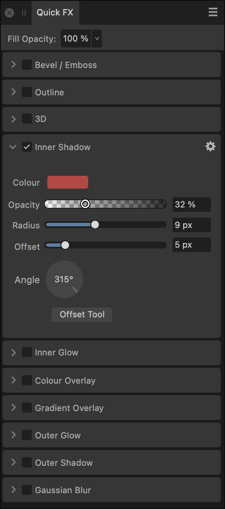

# Quick FX panel

Apply layer effects directly to objects or layers using the **Quick FX** panel.

## About the Quick FX panel

Layer effects can be applied to the currently selected object or entire layer. These effects are also completely non-destructive so you can change them at any time.

*The Quick FX panel.*

The following controls and effects are available in the panel:

- **Fill Opacity**—alters the stroke and fill opacity of the object (layer), without altering the opacity of the applied layer effect(s). This is especially useful for further exposing the effect when used on artistic text or shapes.
- **Gaussian Blur**—blurs the object (layer).
- **Outer Shadow**—adds a shadow behind the object (layer).
- **Inner Shadow**—adds a shadow inside the object edge (layer).
- **Outer Glow**—adds a colour glow that emanates from the outside edges (layer).
- **Inner Glow**—adds a colour glow that emanates from the inside edges (layer).
- **Outline**—adds an outline to the object edge (layer).
- **3D**—adds lighting to give a 3D appearance.
- **Bevel/Emboss**—adds various combinations of highlights and shadows.
- **Colour Overlay**—applies a solid colour to object (layer).
- **Gradient Overlay**—applies a linear gradient to object (layer).

> **Note:** More advanced controls for shadows, 3D effects, bevel/emboss, and overlays are available via **Layer>Layer Effects**.

#### SEE ALSO:

- [Using layer effects](../18-layer-effects/01-using-layer-effects.md)
- [Styles](../08-object-control/21-styles.md)
- [Customising the workspace](../21-workspace/customise/02-workspace.md)
