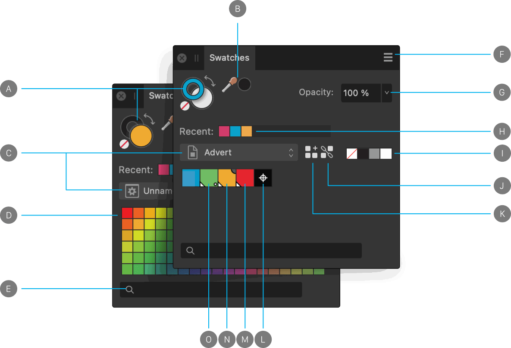
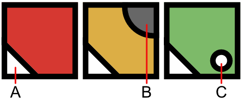

# Swatches panel

The **Swatches** panel makes it easy to use predefined colours, and also to define, store and reuse your own selection of colours.

## About the Swatches panel

**macOS:**

The **Swatches** panel stores your recently used colours and lets you access a range of predefined palettes, each containing solid or gradient fill swatches. These can be selected for use with various tools and for applying directly to objects. You can also create and store your own swatches as custom colour palettes either for the document, application or system-wide, as well as import any exported Affinity .afpalette from other users or import Adobe Swatch Exchange (ASE) palettes.

**Windows:**

The **Swatches** panel stores your recently used colours and lets you access a range of predefined palettes, each containing solid or gradient fill swatches. These can be selected for use with various tools and for applying directly to objects. You can also create and store your own swatches as custom colour palettes either for the document or application, as well as import any exported Affinity .afpalette from other users or import Adobe Swatch Exchange (ASE) palettes.

As well as accessing palette, you can create global and spot colours, and make colours overprint. Your registration colour can also be customised.

*Swatches panel: (A) Primary/Secondary (left) or Stroke/Fill colour selectors with colour 'none' swatch and 'swap' arrow, (B) Colour picker tool and picked colour swatch, (C) Category list (showing Application, left, and Document, right), (D) Category colour palette swatches, (E) Search, (F) Panel Preferences, (G) Opacity control, (H) Recently used colours, (I) None, Black, Mid-grey and White swatches, (J) Add current colour to palette as a global colour, (K) Add current colour to palette, (L) Registration colour, (M) Global colour, (N) Overprint colour, (O) Spot colour.*

*Markings which distinguish specialist colour swatches: (A) Global, (B) Overprint, (C) Spot.*

Like the **Colour** panel, the Swatches panel has different states depending on the active Persona and on the selected tool. The large colour swatch selectors indicate the currently selected colours.

- In Designer Persona, objects have fill and stroke colour properties. The stroke colour is represented by the cutout (donut) colour selector. The fill is represented by the solid colour selector.
- In Pixel Persona, the two solid colour selectors indicate interchangeable Primary and Secondary colours.

The **Swatches** panel also shows None, Black, Mid-grey and White swatches, recently used colours and an opacity control. Swatches are organised into colour palettes by category.

> **Note:** 
>
>  To add a customised registration colour for professional printing, click **Panel Preferences**, then select **Add Registration Colour**.

> **Note:** Preset colour palettes (available from the category list pop-up menu) include **macOS:**
>
> macOS colour palettes such as Apple,
>
> Web Safe Colours, System, and Crayons.
>
>
> 
>
>  To list swatches by name instead of thumbnail, click **Panel Preferences**, then select **Appearance>Show as List**.

> **Tip:** The active swatch is whichever is shown in front of the other. You can switch between the primary and secondary colour selectors by pressing the **X** .

> **Tip:** You can set the primary (fill) and secondary (stroke) colour selectors to white and black, respectively, by pressing the **D** . This affects any vector objects that are selected.

> **Note:** These swatches change appearance for some vector tools.
>
>
> - 
>
>    **Fill Tool**: When selected, only one colour selector swatch is shown to represent the fill only.
> - 
>
>    **Vector Brush Tool**: When selected, the panel shows primary and secondary swatches that can be swapped by clicking the adjacent double arrow.

## Working with palettes

The ten most recently used colours are automatically added to the panel on a temporary basis. You can permanently store custom colours and gradients that you use most often in any of the palettes or you can create custom palettes to host them.

> **Tip:** Although you can add colours to any of the predefined palette categories, we recommend that you always create your own.

The following types of palette exist within Affinity Designer:

- **Document**—these palettes are saved within the current document.
- **Application**—these palettes are saved within Affinity Designer. These palettes are available to any Affinity Designer document.
- **System**—these palettes are saved to your operating system. These palettes are available within Affinity Designer and other applications installed on your system.
- **PANTONE®**—these palettes are based on PANTONE® Colours. These palettes are available to any Affinity Designer document.

## Saving and deleting custom colour palettes

**

 To create a new palette:**

- Click Panel Preferences and choose an **Add Palette** option.

> **Note:** From Panel Preferences, you can also rename, delete, duplicate and link the selected palette.

**

 To save a colour or gradient to a palette:**

1. On the **Swatches** panel, select a palette from the palette pop-up menu.
2. Do one of the following:
   - `Click`-click an object, then from the pop-up menu, click **Add to Swatches** and choose to add colour from fill, stroke or both.
  - Select **Add current colour to palette**. Use the Stroke/Fill colour selector to target the colour.

**To edit a saved swatch:**

- Double-click a saved swatch.

**To delete a saved swatch:**

- `Click`-click the swatch you want to remove and choose **Delete Fill** from the pop-up menu.

## Generating a palette from document

You can generate a palette from the colours used throughout your document.

**

 To generate a palette from document:**

- Click Panel Preferences and choose an option from **Create Palette from Document**.

A new palette is created (named after the document) using all the colours currently in the document.

## Importing and exporting custom colour palettes

Custom colour palettes can be exported to and imported from external files (add-ons) via the Panel Preferences menu. For more information on add-ons, see the [About add-ons](../16-add-ons/01-about-add-ons.md) topic.

## Setting default palettes

Any palette can be set as the default used for specific colour formats. For example, you can set **RGB/8** documents to have a different default palette to **CMYK/8** documents.

**

 To set a default palette:**

1. On the **Swatches** panel, select a palette from the palette pop-up menu.
2. Click Panel Preferences and choose a colour format option from the **Set as Default for** from the pop-up menu.

To revert to using a system palette, choose **Remove Default for <colour format>** from Panel Preferences.

#### SEE ALSO:

- [Selecting colours](../06-colour/06-selecting-colours.md)
- [Colour panel](06-colour-panel.md)
- [Colour chords](../06-colour/11-colour-chords.md)
- [Global colours](../06-colour/08-global-colours.md)
- [Spot colours](../06-colour/09-spot-colours.md)
- [Customising the workspace](../21-workspace/customise/02-workspace.md)
- [About add-ons](../16-add-ons/01-about-add-ons.md)
- [Importing add-ons](../16-add-ons/04-importing-add-ons.md)
- [Exporting add-ons](../16-add-ons/03-exporting-add-ons.md)
