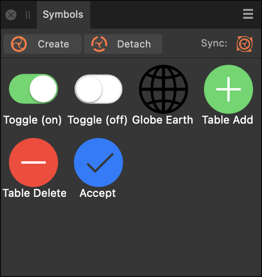

# Symbols panel

The **Symbols** panel lets you create and store symbols from a selected object or group on the page.

## About the Symbols panel

Once symbols are created within the panel they can dragged onto the page or artboard multiple times. These placed symbol instances are linked and, due to synchronisation, any edit made to an individual symbol instance will be applied across all symbol instances.

The **Symbols** panel is hidden by default. It can be switched on via the **Window** menu when working in Designer or Pixel Persona.

*The Symbols panel displaying available symbols and with synchronization switched on.*

### Options

The following options are available in the panel:

- 

   **Create**—Creates a symbol from the currently selected object or group.
- 

   **Detach**— Reverts the symbol instance back to being a standard object.
- 

   **Sync**—When enabled, all symbol instances on the page automatically update if any one symbol instance is edited. When Sync is disabled, edits are made just to that symbol in isolation.

#### SEE ALSO:

- [Using symbols](../08-object-control/25-symbols.md)
- [Customising the workspace](../21-workspace/customise/02-workspace.md)
