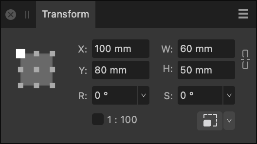

# Transform panel

When selected, an object (or layer) can be easily moved, resized and sheared by adjusting the values in the **Transform** panel.

> **Note:** When used in conjunction with the **Node Tool**, selected nodes can be positioned or scaled precisely using the **Transform** panel.

## About the Transform panel

The **Transform** panel places objects (or layers) precisely. All transforms are carried out in relation to a defined anchor point—corner, edge midpoint or centre—allowing the selected object or layer's position, width, height, rotation angle and shear to be adjusted.

If an object has a custom transform origin applied, it can be resized, rotated or sheared about that centre using the options on the panel.

*The Transform panel showing settings applied to an object.*

The following controls are found on the **Transform** panel:

- Anchor point selector—transforms are carried out from the selected anchor point. Click on an anchor point to select. If the object has a custom transform origin, it will be ignored if this selector is then used.
- **X**—Horizontal position. Increasing the value moves the selected object (layer) to the right.
- **Y**—Vertical position. Increasing the value moves the selected object (layer) down the page.
- **W**—Width. Adjusts the object (layer) width in relation to the selected anchor point.
- **H**—Height. Adjusts the object (layer) height in relation to the selected anchor point.
- 

   

   Link—when enabled, width and height are adjusted in proportion to each other, maintaining the current aspect ratio. When deselected, they can be adjusted independently.
- **R**—Rotation. Rotates the object (layer) by a specified number of degrees in relation to the selected anchor point.
- **S**—Shear. Shears the object (layer) by a specified number of degrees in relation to the selected anchor point.
- **L**—Length. Replaces Shear (S) when a straight line is selected using the **Move Tool**. Allows you to precisely adjust the line's length. The Anchor point selector changes its appearance for straight lines.
- **Scale**—For scale drawings, check or uncheck to display scaled or unscaled object dimensions in the panel, respectively. The scale factor is reported alongside the checkbox.
- 

   **Scale Override**—when enabled, the option forces the scaling of stroke width, layer effect radii, shape tools' corner radii and text frame content on the object when it is resized. Click the down arrow to control which object properties will be exempt from scaling.

> **Note:** All transform measurements are in relation to the ruler's zero point, and display in the currently set measurement units.
>
>
> **macOS:**
>
> The number of decimal places allowed can be set via **Affinity Designer>Settings** (or **>Preferences**) (**User Interface**).
>
>
> **Windows:**
>
> The number of decimal places allowed can be set via **Edit>Settings** (**User Interface**).

#### SEE ALSO:

- [Rulers](../17-design-aids/08-rulers.md)
- [Transforming objects](../08-object-control/16-transforming-objects.md)
- [Rotating and shearing objects](../08-object-control/17-rotating-and-shearing-objects.md)
- [Drawing scale](../03-get-started/09-drawing-scale.md)
- [Node Tool](../22-tools/design-tools/02-node-tool.md)
- [Customising the workspace](../21-workspace/customise/02-workspace.md)
