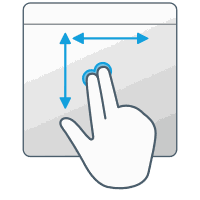

**macOS:**

# Using a trackpad

Affinity products are designed to be used in conjunction with multitouch devices (Magic Mouse and trackpads), including those with Force Touch pressure-sensitive capability (Magic Trackpad 2 and built into recent MacBooks).

The following gestures are available in your Affinity app when using a trackpad:

Point & Click

Scroll & Zoom

Tap to click

Makes a selection.

Look up

Displays context menu (Force Touch only).

Two-finger click

Displays context menu.

Scroll direction

Pans around document view.

Zoom in/out

Pinch/spread with two fingers to zoom in/out.

Smart zoom

Switches between current zoom and 100% zoom by double tap.

Scroll direction (modifier)

Zooms in and out. Tracks finger movement.

Rotate

Rotates canvas about current cursor position.

**To enable/disable availability of a multitouch gesture:**

1. In macOS's System Settings (or System Preferences) app, click **Trackpad**.
2. Select **Point & Click** or **Scroll & Zoom**.
3. Check or uncheck the box next to the relevant gesture.

Disabling a multitouch gesture is system-wide, not just for your Affinity app.

**To enable/disable trackpad-based canvas rotation:**

1. Select **Affinity Designer>Settings** (or **>Preferences**).
2. Select **Tools**.
3. Check or uncheck **Enable canvas rotation with trackpad**.
4. In macOS's System Settings (or System Preferences) app:
   1. Click **Trackpad**.
  2. Select **Scroll & Zoom**.
  3. Check or uncheck **Rotate** so it matches your choice in Affinity Designer.

> **Note:** The canvas's orientation can be reset by selecting **View>Reset Rotation**.

**To enable/disable Force Touch:**

1. In macOS's System Preferences app, click **Trackpad**.
2. Select **Point & Click**.
3. Check or uncheck **Force Click and haptic feedback**.

Disabling this feature is system-wide, not just for your Affinity app.

**To enable/disable the Force Touch context menu:**

Force Touch can be used as an alternative to `Click`-clicking or using macOS's Secondary click trackpad gesture (if enabled).

1. Select **Affinity Designer>Settings** (or **>Preferences**).
2. Select **Tools**.
3. Check or uncheck **Force Touch context menu**.

#### SEE ALSO:

- [Pressure sensitivity](../../05-drawing-curves-and-shapes/14-pressure-sensitivity.md)
- [Modifying vector brush strokes](../../10-vector-painting/02-modifying-vector-brush-strokes.md)
