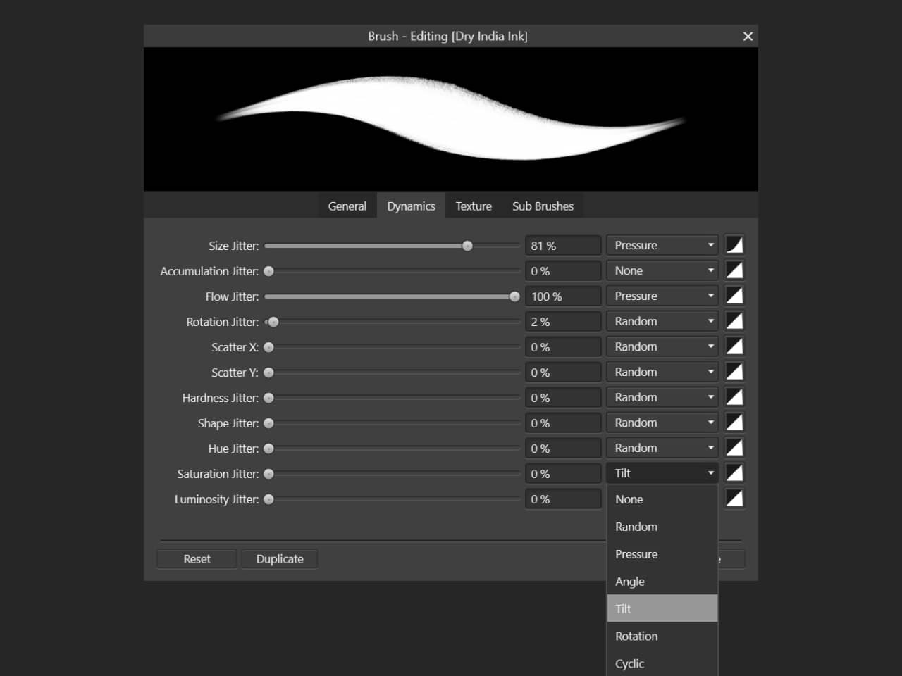

**Windows:**

# Using Surface Pen

You can use a Microsoft Surface Pen to interact with your Affinity app's user interface and to paint and draw using creative tools.

*The pressure and tilt of Surface Pen can be used to control brush tool attributes.*

## Integration with your Affinity app

On compatible hardware, Surface Pen provides pressure and tilt input to your Affinity app. For example, a brush's dynamics can be configured so that pressure creates variation in brush size and tilt controls saturation.

When you turn Surface Pen around and use its eraser, your Affinity app recognises whether the current layer contains vector or raster objects and masks out or erases the areas of contact, respectively. This happens without you having to manually perform additional steps, such as switch Persona, create a mask layer, or select the **Erase Brush Tool**.

For your Affinity app to use contact from Surface Pen but not your fingers for tool interaction, turn on **Touch for gestures only** in its **Tools** settings.

## Use Surface Pen pressure and tilt input

**To assign Surface Pen input to brush attributes:**

1. On the **Brushes** panel, select a brush.
2. Click **Edit Brush**.
3. Select **Dynamics**.
4. Next to **Size Jitter**, ensure the pop-up menu is set to **Pressure**. Adjust the jitter amount and Ramp profile as required.
5. Next to another attribute, such as **Saturation Jitter**, set the pop-up menu to **Tilt**. Adjust the attribute's jitter amount and Ramp profile as required.

#### SEE ALSO:

- [Customising the workspace](../../21-workspace/customise/02-workspace.md)
- [Using Surface Dial with your Affinity Windows apps](05-using-surface-dial.md)
