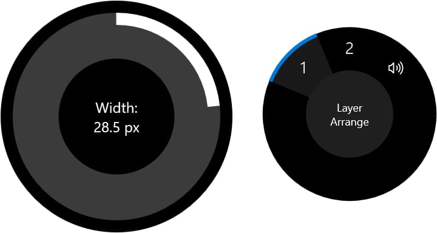
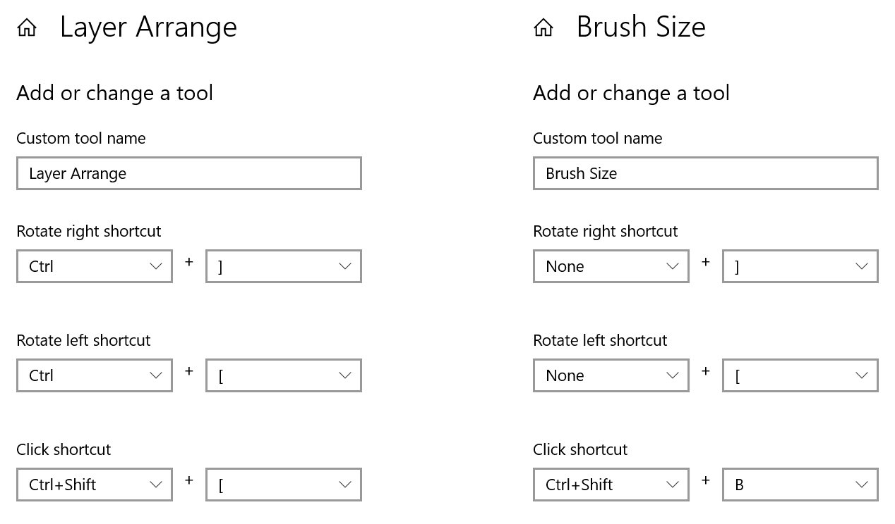

**Windows:**

# Using Surface Dial

Microsoft's Surface Dial enables you to invoke Affinity menu commands and adjust tool settings by clicking and turning a rotary control.

To use it with your Affinity app, first follow [Microsoft's instructions](https://support.microsoft.com/help/4023515) to connect it to your PC, then enable support in your Affinity app's settings: select **Tools** and tick **Enable Dial support**.

## Integration with your Affinity app

After restarting the app, turning the dial while the **Move Tool** is selected will rotate the document in the view. Click the dial to reset the document's orientation.

With one of the Pixel, Erase or various other pixel-based brush tools selected, click Surface Dial to choose which attribute (brush width, accumulation, flow, and hardness) is adjusted by rotating the Dial. These tools display a large graphical overlay that provides clear feedback.

*Examples of on-screen displays when controlling brush attributes (left) and selecting custom commands (right).*

If a tool does not provide predefined Surface Dial gestures, you can assign choices in Windows' Settings app. Your custom commands are available from an on-screen menu, which appears when you press and hold down on the Dial.

> **Note:** Some commands in your Affinity app do not have keyboard shortcuts assigned to them by default. You will need to give them shortcuts in the app's Keyboard Shortcuts preferences before configuring Surface Dial to invoke them.

## Example custom commands for Surface Dial in Affinity apps

Below are examples of how you might use Surface Dial in your workflow to control brush size and layer order. The walkthroughs at the bottom of this page explain how to implement these and other personalisations.

*Example custom commands for controlling layer order and vector brush size using Surface Dial.*

In the left example above, rotating the Dial moves the current layer back or forward progressively in the layer stack, while clicking it sends the layer all the way to the back.

In the right example, rotating the Dial adjusts brush size (as long as the appropriate tool is selected). The **Click shortcut** toggles the Brushes Panel; normally there is no keyboard shortcut assigned to this action, so you'll need to set the same key combination in your Affinity app's settings.

## Customise Surface Dial integration

**To assign a tool to Surface Dial's on-screen menu:**

1. Do one of the following:
   - Select **Settings** from the **Start menu**, select **Devices** and then select **Bluetooth & other devices**.
  - Click the Bluetooth icon in the taskbar's notification area and select **Show Bluetooth Devices**.
2. On the left, select **Wheel**.
3. Under **App tools** on the right, click **Add an app**.
4. Select your Affinity app from the list.
5. Select **Add a tool**.
6. Type a custom tool name. This will be displayed in Surface Dial's on-screen menu.
7. Beneath **Rotate right shortcut**, **Rotate left shortcut**, or **Click shortcut**, set the keyboard shortcut for the Affinity tool/command you want to access using Surface Dial's on-screen menu.
8. (Optional) Repeat the previous step for the other two gestures.
9. Click **Done**.

**To invoke a custom Surface Dial command:**

1. Click the Surface Dial.
2. Rotate the Dial so your command is highlighted.
3. Click the Dial to select the command.
4. Rotate left, rotate right or click the Dial to invoke the required command. Repeated rotation is interpreted as a repeated key press.

#### SEE ALSO:

- [Customising the workspace](../../21-workspace/customise/02-workspace.md)
- [Using Surface Pen with your Affinity Windows apps](04-using-surface-pen.md)
