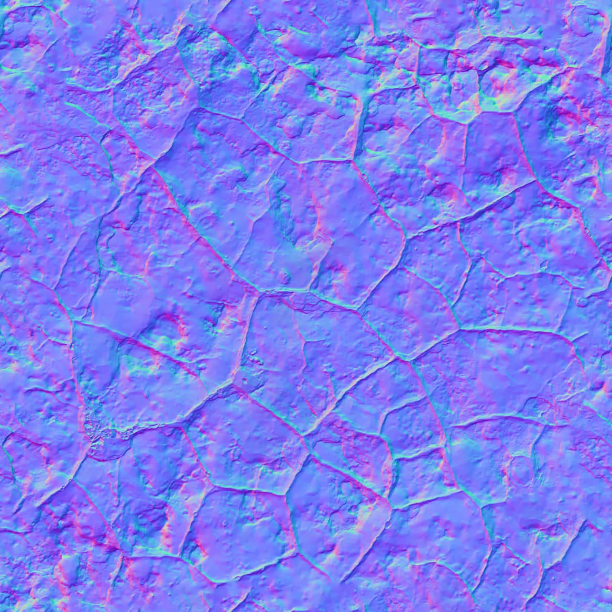
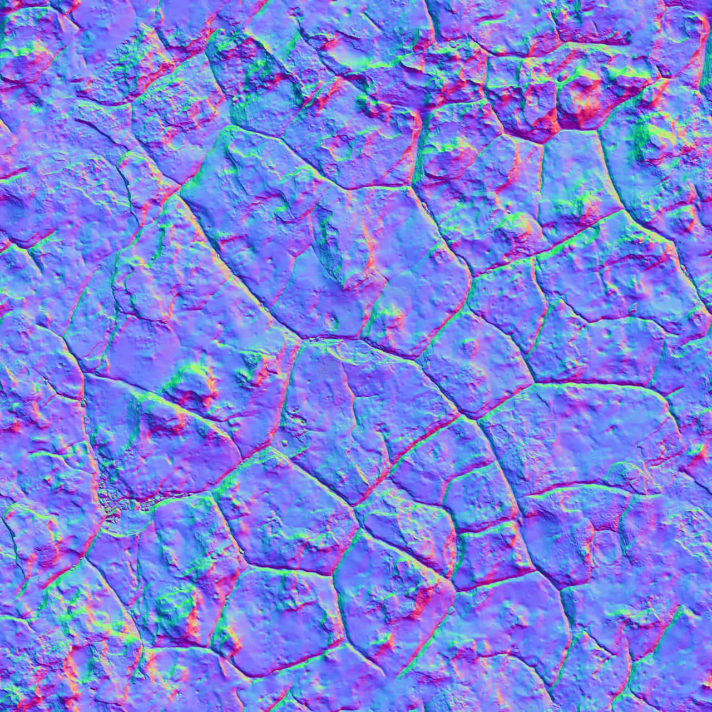

# Normals adjustment

Using Normals adjustments lets you correct and enhance lighting layers (i.e. normal map texture files) independently of your 3D app. In particular, you can rotate, scale and flip the Y (or X) axis of the normals in the file. In some instances you can experiment with scaling to control how dramatic the texture appears, rather than just correcting the file (e.g., when flipping axes).

*Before and after adjustment applied (flipped Y-axis for DirectX to OpenGL format conversion).*

### Settings

The following settings can be adjusted:

- **Rotation**—drag the slider to rotate the normals on all faces away from their current direction by a configurable amount of degrees.
- **Scale**—drag the slider to control the scaling of normals on all faces.
- **Flip X**—reverses the orientation of the normals on the X-axis.
- **Flip Y**—reverses the orientation of the normals on the Y-axis. Check for OpenGL format; leave unchecked for DirectX format.

#### SEE ALSO:

- [Applying adjustments](../19-adjustments/01-applying-adjustments.md)
