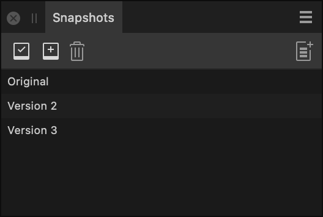

# Snapshots panel

The **Snapshots** panel lets you 'save' multiple states of your document in the same file, and restore your document to any of these states in an instant.

*The Snapshots panel showing several 'saved' snapshots.*

> **Note:** In contrast, the **History** panel automatically logs every edit that's made to your document, and lets you step back through them, one at a time, to the exact point that's required.

## About the Snapshots panel

In the **Designer Persona** and **Pixel Persona**, the Snapshots panel can be switched on via the **Window** menu.

Snapshots are created manually at any time of your choosing.

By default, a snapshot's name is its date and time of creation, but you can provide a name that is more meaningful to you.

Restoring a snapshot does not delete it or any other snapshot from your document. When a snapshot is no longer required, you must manually delete it.

### Settings

The following options are available on the panel:

- 

   **Restore Snapshot**—restores the document to the state stored in the selected snapshot.
- 

   **Add Snapshot**—adds a snapshot of the document's current state, including all its layers.
- 

   **Delete Snapshot**—deletes the selected snapshot from your document and the panel's snapshot list.
- 

   **New Document From Snapshot**—with a snapshot selected on the panel, creates a new document from it.
- 

   **Set Undo Brush Source**—enable the icon preceding an entry to set the chosen source from which the Undo Brush Tool can paint back to.

#### SEE ALSO:

- [Using snapshots](../17-design-aids/16-using-snapshots.md)
- [History panel](../23-panels/09-history-panel.md)
- [Customising the workspace](../21-workspace/customise/02-workspace.md)
